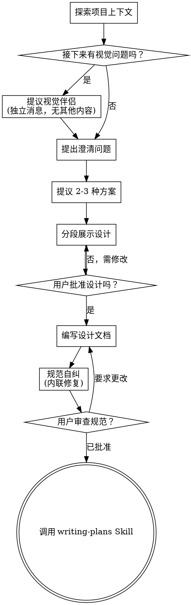

# 头脑风暴：从想法到设计 (Brainstorming Ideas Into Designs)

通过自然的协作对话，帮助将想法转化为完整的架构设计和规范。

首先了解当前项目的上下文，然后一次提出一个问题来完善想法。一旦你理解了要构建的内容，请展示设计方案并获得用户批准。

<HARD-GATE>
在展示设计并获得用户批准之前，**严禁**调用任何实施类 Skill、编写任何代码、搭建任何项目或采取任何实施行动。这适用于每一个项目，无论其看起来多么简单。
</HARD-GATE>

## 反模式：“由于太简单而不需要设计”

每个项目都必须经过这个流程。待办事项列表、单一功能的实用程序、配置更改——无一例外。“简单”的项目往往是未经审查的假设导致最多无效工作的地方。设计方案可以很短（对于真正简单的项目，几句话即可），但你**必须**展示它并获得批准。

## 清单

你**必须**为以下每一项创建一个任务，并按顺序完成：

1. **探索项目上下文** —— 检查文件、文档、最近的提交。
2. **提议视觉伴侣 (Visual Companion)** —— 如果主题涉及视觉问题（这应作为独立消息发送，不与澄清问题合并）。参见下方的“视觉伴侣”部分。
3. **提出澄清问题** —— 每次一个，了解目的/约束/成功标准。
4. **提议 2-3 种方案** —— 列出利弊及你的建议。
5. **展示设计** —— 根据复杂度分段展示，每一段都要获得用户批准。
6. **编写设计文档** —— 保存至 `docs/superpowers/specs/YYYY-MM-DD-<topic>-design.md` 并提交。
7. **规范自纠** —— 对占位符、矛盾点、歧义和范围进行内联检查（见下文）。
8. **用户审查已写规范** —— 在继续之前，请用户查阅规范文件。
9. **过渡到实施** —— 调用 `writing-plans` Skill 来创建实施计划。

## 流程图

**终点状态是调用 writing-plans。** 严禁在此阶段调用 `frontend-design`、`mcp-builder` 或任何其他实施类 Skill。头脑风暴后你唯一能调用的 Skill 就是 `writing-plans`。

## 详细流程

**理解想法：**

- 首先检查当前项目状态（文件、文档、最近的提交）。
- 在提出详细问题之前，评估范围：如果请求描述了多个独立的子系统（例如：“构建一个具有聊天、文件存储、计费和分析功能的平台”），请立即指出。不要在需要先行拆解的项目细节上浪费提问次数。
- 如果项目对于单一规范来说太大，帮助用户拆解成子项目：有哪些独立部分、它们如何关联、应该按什么顺序构建？然后通过正常的设计流程对第一个子项目进行头脑风暴。每个子项目都有自己的“规范 -> 计划 -> 实施”循环。
- 对于范围适中的项目，每次提出一个问题来完善想法。
- 尽可能优先使用多项选择题，但开放式问题也可以。
- 每条消息只提一个问题 —— 如果一个主题需要深入探讨，请将其拆分为多个问题。
- 专注于理解：目的、约束、成功标准。

**探索方案：**

- 提议 2-3 种具有不同利弊的方案。
- 以对话方式向用户展示选项，并给出你的建议和理由。
- 率先给出你的推荐选项并解释原因。

**展示设计：**

- 一旦你认为自己理解了要构建的内容，请展示设计方案。
- 根据各部分的复杂度进行扩展：如果很简单，几句话即可；如果有细微差别，可达 200-300 字。
- 每段之后都要询问目前看起来是否正确。
- 涵盖：架构、组件、数据流、错误处理、测试。
- 随时准备在出现不理解的地方时返回并澄清。

**隔离与清晰度设计：**

- 将系统分解成较小的单元，每个单元都有一个明确的目标，通过定义良好的接口进行通信，并且可以独立地理解和测试。
- 对于每个单元，你应该能够回答：它做什么、如何使用它、它依赖什么？
- 是否有人可以在不阅读内部实现的情况下理解该单元的作用？你是否可以更改内部实现而不破坏使用者？如果不能，则边界需要调整。
- 较小的、边界良好的单元也更容易让你处理 —— 你能更好地推理出可以同时容纳在上下文中的代码，并且当文件聚焦时，你的编辑会更可靠。当文件变得过大时，这通常意味着它做得太多了。

**在现有代码库中工作：**

- 在提议更改之前探索现有结构。遵循既有模式。
- 如果现有代码存在影响工作的问题（例如：文件过大、边界不明、职责混乱），请在设计中包含针对性的改进 —— 就像任何优秀的开发者都会改进他们正在处理的代码一样。
- 不要提议无关的重构。专注于服务于当前目标。

## 设计之后的工作

**文档化：**

- 将经过验证的设计（规范）写入 `docs/superpowers/specs/YYYY-MM-DD-<topic>-design.md`。
  - （如果用户对规范存放位置有偏好，则覆盖此默认设置）
- 若可用，使用 `elements-of-style:writing-clearly-and-concisely` Skill。
- 将设计文档提交至 Git。

**规范自测 (Spec Self-Review)：**
在编写完规范文档后，以全新的视角审视它：

1. **占位符扫描：** 是否有 "TBD"、"TODO"、不完整的章节或模糊的要求？修复它们。
2. **内部一致性：** 各章节之间是否存在矛盾？架构是否匹配功能描述？
3. **范围检查：** 它是否足够聚焦于单一的实施计划，还是需要拆解？
4. **歧义检查：** 是否有任何要求可以有两种不同的解释？如果有，选定一种并明确化。

直接在文档中修复发现的问题。无需重新审查 —— 修复后继续即可。

**用户审查关卡 (User Review Gate)：**
在规范评审循环通过后，请用户在继续之前查阅已编写的规范：

> “规范已编写并提交至 `<路径>`。在我们开始制定实施计划之前，请审阅并告诉我你是否需要进行任何更改。”

等待用户回复。如果他们要求更改，请修改并重新运行规范评审循环。仅在用户批准后继续。

**实施：**

- 调用 `writing-plans` Skill 来创建详细的实施计划。
- **严禁**调用任何其他 Skill。`writing-plans` 是下一步。

## 核心原则

- **一次只提一个问题** —— 不要用多个问题轰炸用户。
- **多选题优先** —— 尽可能比开放式问题更容易回答。
- **冷酷地精简 (YAGNI)** —— 从所有设计中移除不必要的功能。
- **探索替代方案** —— 始终在确定方案前提供 2-3 种选择。
- **增量验证** —— 展示设计，获得批准后再继续。
- **保持灵活性** —— 当某些内容不合理时，返回并澄清。

## 视觉伴侣 (Visual Companion)

这是一个基于浏览器的伴侣程序，用于在头脑风暴期间展示原型、图表和视觉选项。作为工具使用，而非一种模式。接受该伴侣意味着它可用于受益于视觉化处理的问题；但并不意味着每个问题都要通过浏览器处理。

**提议伴侣：** 当你预估接下来的提问将涉及视觉内容（原型、布局、图表）时，提议一次以征得同意：
> “我们正在处理的内容中，有些如果我能在浏览器中向你展示，解释起来会更容易。我可以在过程中制作原型、图表、对比图和其他视觉效果。此功能目前尚处于实验阶段，且可能会消耗较多 Token。想尝试一下吗？（需要打开一个本地 URL）”

**该提议必须是一条独立的消息。** 不要将其与澄清问题、上下文总结或任何其他内容合并。该消息应**仅**包含上述内容。等待用户响应后再继续。如果他们拒绝，请继续进行仅限文本的头脑风暴。

**每题决策：** 即使用户接受了，也要**针对每个问题**决定是使用浏览器还是终端。测试标准：**看到它是否比读到它能让用户理解得更好？**

- **使用浏览器**处理视觉内容 —— 原型、线框图、布局对比、架构图、并排视觉设计。
- **使用终端**处理文本内容 —— 需求提问、概念性选择、利弊清单、A/B/C/D 文本选项、范围决策。

关于 UI 主题的问题不自动等同于视觉问题。“在此上下文中个性化意味着什么？”是一个概念性问题 —— 使用终端。“哪种向导布局更好？”是一个视觉问题 —— 使用浏览器。

如果他们同意使用该伴侣，请在继续之前阅读详细指南：
`visual-companion.md`（位于本 Skill 目录下）
