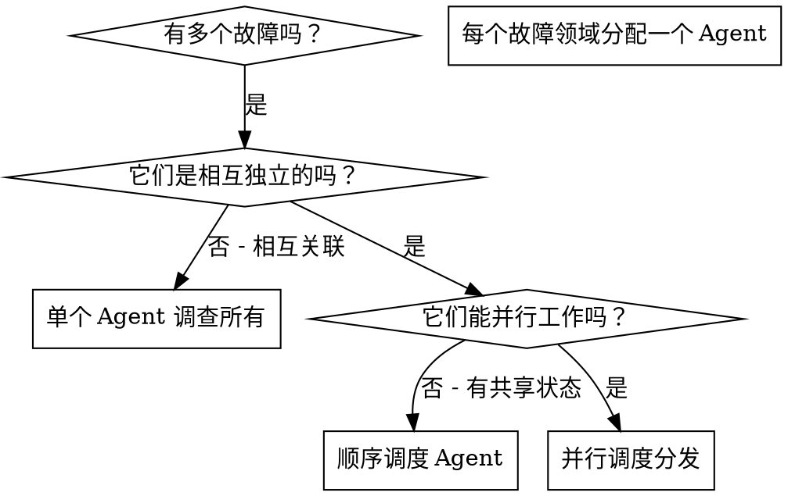

# 并行 Agent 调度 (Dispatching Parallel Agents)

## 概述

你将任务委派给具有隔离上下文的专业 Agent。通过精确构建它们的指令和上下文，你可以确保它们专注于并成功完成任务。它们绝不应继承你当前会话的上下文或历史——你应该准确构建它们所需的内容。这也为你自己保留了用于协调工作的上下文。

当你遇到多个互不相关的故障（不同的测试文件、不同的子系统、不同的 Bug）时，按顺序调查它们会浪费时间。每项调查都是独立的，可以并行进行。

**核心原则：** 为每个独立的故障领域分配一个 Agent。让它们并发工作。

## 何时使用



**在以下情况下使用：**
- 3 个或更多测试文件失败，且根因各不相同。
- 多个子系统独立损坏。
- 每个问题都可以在不参考其他问题上下文的情况下被理解。
- 各项调查之间没有共享状态。

**不要在以下情况下使用：**
- 故障是相关的（修复其中一个可能会修复其他）。
- 需要理解完整的系统状态。
- 不同 Agent 之间会相互干扰。

## 模式流程

### 1. 识别独立的领域

按损坏的内容对故障进行分组：
- 文件 A 的测试：工具审批流。
- 文件 B 的测试：批量完成行为。
- 文件 C 的测试：中止 (Abort) 功能。

每个领域都是独立的——修复工具审批不会影响中止功能的测试。

### 2. 创建专注的 Agent 任务

每个 Agent 获得：
- **具体的范围：** 一个测试文件或子系统。
- **明确的目标：** 使这些测试通过。
- **约束条件：** 不要更改其他代码。
- **预期输出：** 调查发现和修复情况的总结。

### 3. 并行分发

```typescript
// 在 Claude Code / AI 环境中
Task("修复 agent-tool-abort.test.ts 的失败项目")
Task("修复 batch-completion-behavior.test.ts 的失败项目")
Task("修复 tool-approval-race-conditions.test.ts 的失败项目")
// 这三个任务将并发运行
```

### 4. 审查与集成

当 Agent 返回结果时：
- 阅读每一份总结。
- 验证修复方案之间没有冲突。
- 运行完整的测试套件。
- 集成所有更改。

## Agent 提示词结构

优秀的 Agent 提示词应具备：
1. **焦点明确** —— 一个清晰的问题领域。
2. **自给自足** —— 提供理解问题所需的所有上下文。
3. **输出具体** —— Agent 应该返回什么？

```markdown
请修复 src/agents/agent-tool-abort.test.ts 中的 3 个失败测试：

1. "should abort tool with partial output capture" - 预期消息中包含 'interrupted at'
2. "should handle mixed completed and aborted tools" - 快速工具被中止而非完成
3. "should properly track pendingToolCount" - 预期 3 个结果但实际得到 0 个

这些是时序/竞态条件问题。你的任务：

1. 阅读测试文件，理解每个测试验证的内容。
2. 识别根因 —— 是时序问题还是真实的 Bug？
3. 通过以下方式修复：
   - 用基于事件的等待取代随机的超时 (Timeout)。
   - 如果发现中止实现中的 Bug，请予以修复。
   - 如果测试的是已变更的行为，请调整测试预期。

严禁仅仅增加超时时间 —— 请找到真正的问题。

返回：你发现的问题以及你修复的内容的总结。
```

## 常见错误

**❌ 太宽泛：** “修复所有测试” —— Agent 会迷失方向。
**✅ 具体的：** “修复 agent-tool-abort.test.ts” —— 范围聚焦。

**❌ 无上下文：** “修复竞态条件” —— Agent 不知道在哪里。
**✅ 有上下文：** 粘贴错误消息和测试名称。

**❌ 无约束：** Agent 可能会重构一切。
**✅ 设置约束：** “不要更改生产代码”或“仅修复测试代码”。

**❌ 输出模糊：** “修好了” —— 你不知道改了什么。
**✅ 输出具体：** “返回根因和变更内容的总结”。

## 什么时候不该使用

**关联故障：** 修复一个可能会修复其他 —— 应首先一起调查。
**需要完整上下文：** 理解问题需要查看整个系统。
**探索性调试：** 你还不知道哪里坏了。
**共享状态：** Agent 之间会相互干扰（编辑相同文件、使用相同资源）。

## 会话真实案例

**场景：** 大规模重构后，3 个文件中共出现 6 处测试失败。

**故障情况：**
- agent-tool-abort.test.ts: 3 处失败（时序问题）。
- batch-completion-behavior.test.ts: 2 处失败（工具未执行）。
- tool-approval-race-conditions.test.ts: 1 处失败（执行计数 = 0）。

**决策：** 独立领域 —— 中止逻辑、批量完成、竞态条件三者互不相关。

**分发：**
```
Agent 1 → 修复 agent-tool-abort.test.ts
Agent 2 → 修复 batch-completion-behavior.test.ts
Agent 3 → 修复 tool-approval-race-conditions.test.ts
```

**结果：**
- Agent 1：用基于事件的等待取代了超时。
- Agent 2：修复了事件结构 Bug（threadId 位置错误）。
- Agent 3：增加了对异步工具执行完成的等待。

**集成：** 所有修复均独立，无冲突，全量测试全绿。

**节省的时间：** 并行解决了 3 个问题，而非按顺序解决。

## 核心益处

1. **并行化** —— 多项调查同时进行。
2. **专注** —— 每个 Agent 的范围很窄，需要跟踪的上下文较少。
3. **独立性** —— Agent 之间互不干扰。
4. **速度** —— 在解决 1 个问题的时间内解决了 3 个问题。

## 验证

Agent 返回后：
1. **审查每份总结** —— 理解发生了什么。
2. **检查冲突** —— 不同 Agent 是否编辑了相同的代码？
3. **运行完整套件** —— 验证所有修复能协同工作。
4. **抽样检查** —— Agent 可能会犯系统性错误。
