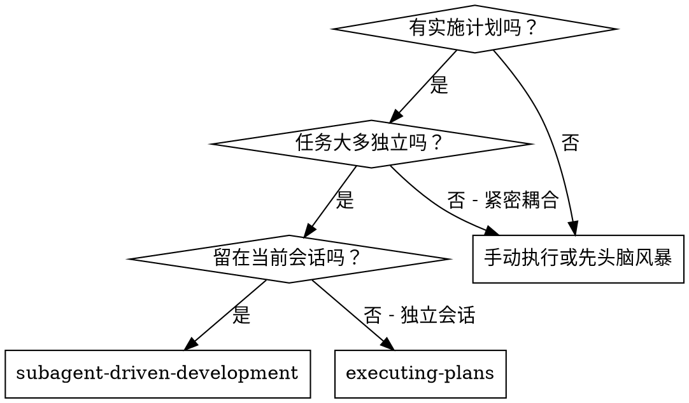
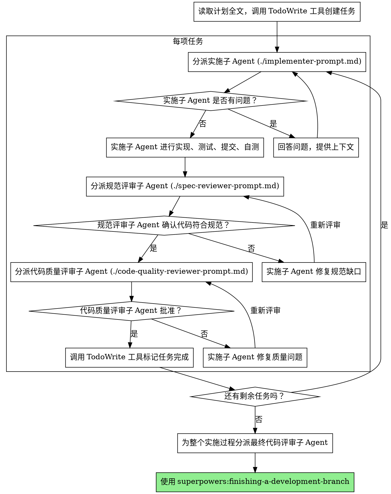

# 子 Agent 驱动开发 (Subagent-Driven Development)

通过为每项任务分派全新的子 Agent (Subagent) 来执行计划，并在每项任务完成后进行两阶段评审：首先是规范合规性评审，然后是代码质量评审。

**为什么使用子 Agent：** 你将任务委派给具有隔离上下文的专业 Agent。通过精确构建它们的指令和上下文，你可以确保它们专注于并成功完成任务。它们绝不应继承你当前会话的上下文或历史 —— 你应该准确构建它们所需的内容。这也为你自己保留了用于协调工作的上下文。

**核心原则：** 每项任务配备全新的子 Agent + 两阶段评审（规范优先，质量随后）= 高质量、快速迭代。

## 何时使用



**对比 执行计划 (Executing Plans)（独立会话）：**
- 同一会话（无上下文切换）。
- 每项测试分派全新的子 Agent（无上下文污染）。
- 每项任务后进行两阶段评审：先看规范合规性，再看代码质量。
- 更快的迭代速度（任务之间无需人类介入）。

## 流程



## 模型选择

为每个角色选择满足需求的、能力最弱的模型，以节省成本并提高速度。

**机械化实施任务**（隔离的函数、清晰的规范、1-2 个文件）：使用快速、廉价的模型。当计划制定良好时，大多数实施任务都是机械化的。

**集成与判断任务**（多文件协调、模式匹配、调试分析）：使用标准模型。

**架构、设计与评审任务**：使用能力最强的模型。

**任务复杂度信号：**
- 涉及 1-2 个文件且规范完整 -> 廉价模型。
- 涉及多个文件且有集成考量 -> 标准模型。
- 需要设计判断或对代码库有广泛理解 -> 能力最高模型。

## 处理实施者状态

实施子 Agent 会报告四种状态之一。请分别妥善处理：

**DONE (完成)：** 进入规范合规性评审。

**DONE_WITH_CONCERNS (完成但有担忧)：** 实施者完成了工作，但标记了疑虑。在继续前，请阅读这些担忧。如果担忧涉及正确性或范围，请在评审前解决它们。如果是观察性结论（如“这个文件正在变得臃肿”），请记录下来并进入评审。

**NEEDS_CONTEXT (需要上下文)：** 实施者需要未提供的信息。提供缺失的上下文并重新分派。

**BLOCKED (已阻塞)：** 实施者无法完成任务。评估阻塞原因：
1. 如果是上下文问题，提供更多上下文并使用相同的模型重新分派。
2. 如果任务需要更多推理，使用能力更强的模型重新分派。
3. 如果任务太大，将其拆分为更小的碎片。
4. 如果计划本身有误，请上报给人类。

**绝不要**忽略上报，也不要在不进行任何更改的情况下强迫同一个模型重试。如果实施者说它卡住了，那么一定有某些地方需要改变。

## 提示词模板

- `./implementer-prompt.md` —— 分派实施子 Agent。
- `./spec-reviewer-prompt.md` —— 分派规范合规评审子 Agent。
- `./code-quality-reviewer-prompt.md` —— 分派代码质量评审子 Agent。

## 工作流示例

```
你：我正在使用“子 Agent 驱动开发”来执行此计划。

[读取使用 EnterPlanMode 保存的计划文件一次]
[提取所有 5 项任务及其全文和上下文]
[调用原生的 TodoWrite 工具创建并包含所有任务]

任务 1：Hook 安装脚本

[获取任务 1 的文本和上下文（已提取）]
[分派带有完整任务文本和上下文的实施子 Agent]

实施者：“在我开始之前 —— 应该在用户级别还是系统级别安装 Hook？”

你：“用户级别 (~/.config/superpowers/hooks/)”

实施者：“明白。现在开始实施……”
[稍后] 实施者：
  - 实现了 install-hook 命令
  - 增加了测试，5/5 通过
  - 自测：发现漏掉了 --force 标志，已补全
  - 已提交

[分派规范合规评审员]
规范评审员：✅ 符合规范 —— 满足所有要求，无多余内容

[获取 Git SHA，分派代码质量评审员]
代码评审员：优点：测试覆盖率好，整洁。问题：无。批准。

[标记任务 1 完成]

任务 2：恢复模式

[获取任务 2 的文本和上下文（已提取）]
[分派带有完整任务文本和上下文的实施子 Agent]

实施者：[无疑问，直接开始]
实施者：
  - 增加了验证/修复模式
  - 8/8 测试通过
  - 自测：一切良好
  - 已提交

[分派规范合规评审员]
规范评审员：❌ 问题：
  - 缺失：进度报告（规范要求“每 100 个条目报告一次”）
  - 多余：增加了 --json 标志（未被要求）

[实施者修复问题]
实施者：移除了 --json 标志，增加了进度报告

[规范评审员再次评审]
规范评审员：✅ 现在符合规范了

[分派代码质量评审员]
代码评审员：优点：稳健。问题（重要）：魔法数字 (100)

[实施者修复]
实施者：提取了 PROGRESS_INTERVAL 常量

[代码评审员再次评审]
代码评审员：✅ 批准

[标记任务 2 完成]

...

[完成所有任务后]
[分派最终代码评审员]
最终评审员：满足所有要求，准备合并

完成！
```

## 优势

**对比 手动执行：**
- 子 Agent 自然而然地遵循 TDD。
- 每项任务都有全新的上下文（无混淆）。
- 并行安全（子 Agent 不会相互干扰）。
- 子 Agent 可以提问（在工作开始前及过程中）。

**对比 执行计划 (Executing Plans)：**
- 同一会话（无移交）。
- 持续推进进程（无需等待）。
- 自动进行评审检查点。

**效率提升：**
- 无文件读取开销（控制者提供全文）。
- 控制者精确策划所需的上下文。
- 子 Agent 预先获得完整信息。
- 问题在开始工作前浮现（而不是事后）。

**质量关卡：**
- 自测在移交前捕获问题。
- 两阶段评审：规范合规，然后是代码质量。
- 评审循环确保修复确实奏效。
- 规范合规性防止过度构建或构建不足。
- 代码质量确保实现方案构建良好。

**成本：**
- 更多的子 Agent 调用（每个任务一个实施者 + 两个评审员）。
- 控制者需要做更多准备工作（预先提取所有任务）。
- 评审循环增加了迭代。
- 但能及早捕获问题（比事后调试更便宜）。

## 红灯信号

**绝不要：**
- 未经用户明确同意，在 `main`/`master` 分支上开始实施。
- 跳过评审（规范合规性评审 或 代码质量评审）。
- 在问题未修复的情况下继续推进。
- 并行分派多个实施子 Agent（会导致冲突）。
- 让子 Agent 自己读取计划文件（请提供全文）。
- 跳过场景设定上下文（子 Agent 需要理解任务所处的背景）。
- 忽略子 Agent 的提问（在让它们继续前先回答）。
- 在规范合规性上接受“差不多就行了”（评审员发现问题 = 未完成）。
- 跳过评审循环（评审员发现问题 = 实施者修复 = 再次评审）。
- 用实施者的自测替代真实的评审（两者都是必需的）。
- **在规范合规性获得 ✅ 之前开始代码质量评审**（顺序错误）。
- 只要任一评审仍有未解决的问题，就不要进入下一项任务。

**如果子 Agent 提出问题：**
- 清晰、完整地回答。
- 如果需要，提供额外的上下文。
- 不要催促它们立即开始实施。

**如果评审员发现问题：**
- 实施者（同一个子 Agent）进行修复。
- 评审员再次评审。
- 重复此过程直至批准。
- 不要跳过重评审。

**如果子 Agent 任务失败：**
- 分派带有具体指令的修复子 Agent。
- 不要尝试手动修复（上下文污染）。

## 集成

**必需的工作流 Skill：**
- **`superpowers:using-git-worktrees`** —— **必需**：开始前设置隔离的工作空间。
- **`superpowers:writing-plans`** —— 创建此 Skill 执行的计划。
- **`superpowers:requesting-code-review`** —— 为评审子 Agent 提供代码评审模板。
- **`superpowers:finishing-a-development-branch`** —— 任务全部完成后结束开发。

**子 Agent 应使用：**
- **`superpowers:test-driven-development`** —— 子 Agent 在每项任务中遵循 TDD。

**替代工作流：**
- **`superpowers:executing-plans`** —— 用于独立会话而非会话内执行。
