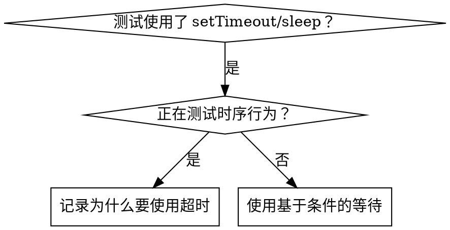

# 基于条件的等待 (Condition-Based Waiting)

## 概述

不稳定的测试 (Flaky tests) 通常会通过随意的延迟来猜测时序。这会产生竞态条件 (Race conditions)，导致测试在高性能机器上通过，但在高负载或 CI 环境下失败。

**核心原则：** 等待你真正关心的**条件**达成，而不是猜测达成该条件需要多长时间。

## 何时使用



**在以下情况下使用：**
- 测试中包含随意的延迟（如 `setTimeout`、`sleep`、`time.sleep()`）。
- 测试不稳定（有时通过，高负载时失败）。
- 并行运行测试时出现超时。
- 等待异步操作完成。

**不要在以下情况下使用：**
- 正在测试实际的时序行为（如防抖 debounce、节流 throttle 的间隔时间）。
- 如果必须使用随意的超时，请务必记录**为什么**。

## 核心模式

```typescript
// ❌ 之前：猜测时序
await new Promise(r => setTimeout(r, 50));
const result = getResult();
expect(result).toBeDefined();

// ✅ 之后：等待条件达成
await waitFor(() => getResult() !== undefined);
const result = getResult();
expect(result).toBeDefined();
```

## 快速参考模式

| 场景 | 模式 |
|----------|---------|
| 等待事件 | `waitFor(() => events.find(e => e.type === 'DONE'))` |
| 等待状态 | `waitFor(() => machine.state === 'ready')` |
| 等待计数 | `waitFor(() => items.length >= 5)` |
| 等待文件 | `waitFor(() => fs.existsSync(path))` |
| 复杂条件 | `waitFor(() => obj.ready && obj.value > 10)` |

## 实现方法

通用轮询函数示例：

```typescript
async function waitFor<T>(
  condition: () => T | undefined | null | false,
  description: string,
  timeoutMs = 5000
): Promise<T> {
  const startTime = Date.now();

  while (true) {
    const result = condition();
    if (result) return result;

    if (Date.now() - startTime > timeoutMs) {
      throw new Error(`等候 ${description} 超时，已耗时 ${timeoutMs}ms`);
    }

    await new Promise(r => setTimeout(r, 10)); // 每 10ms 轮询一次
  }
}
```

参见本目录中的 `condition-based-waiting-example.ts` 了解包含特定领域辅助函数（如 `waitForEvent`、`waitForEventCount`、`waitForEventMatch`）的完整实现。

## 常见错误

**❌ 轮询过快：** `setTimeout(check, 1)` —— 浪费 CPU 资源。
**✅ 修复：** 建议每 10ms 轮询一次。

**❌ 没有设置超时：** 如果条件永远无法达成，会导致死循环。
**✅ 修复：** 始终包含超时限制，并附带清晰的错误信息。

**❌ 数据过期：** 在循环外缓存状态。
**✅ 修复：** 在循环内部调用 Getter 以获取最新数据。

## 何时“固定的超时”是正确的

```typescript
// 工具每 100ms 运行一次 - 需要 2 个周期来验证部分输出
await waitForEvent(manager, 'TOOL_STARTED'); // 首先：等待条件达成
await new Promise(r => setTimeout(r, 200));   // 然后：等待特定的时序行为
// 200ms = 间隔 100ms 的 2 个周期 - 这经过了记录和论证
```

**要求：**
1. 首先等待触发条件达成。
2. 基于已知的时序（而非猜测）。
3. 添加注释解释**为什么**。

## 实际影响

源自调试会话 (2025-10-03)：
- 修复了 3 个文件中的 15 个不稳定测试。
- 通过率：60% → 100%。
- 执行时间：缩短了 40%。
- 彻底消除了竞态条件。
