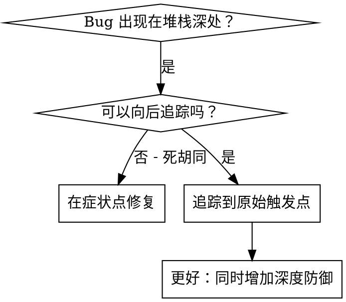
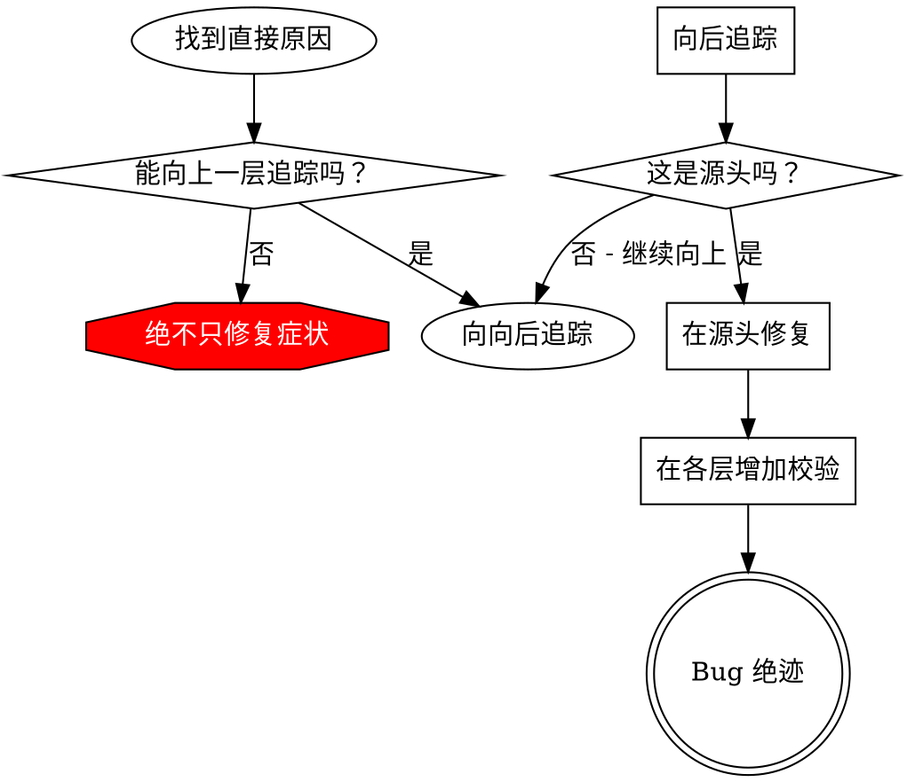

# 根因追踪 (Root Cause Tracing)

## 概述

Bug 通常表现在调用栈的深处（例如：在错误的目录执行了 `git init`、在错误的位置创建了文件、使用错误的路径打开了数据库）。你的直觉可能是就在报错的地方进行修复，但那只是在针对症状进行“对症治疗”。

**核心原则：** 沿着调用链向后追踪，直到找到原始触发点，然后在源头进行修复。

## 何时使用



**在以下情况下使用：**
- 错误发生在执行深处（而非入口点）。
- 堆栈跟踪显示了很长的调用链。
- 不清楚无效数据的来源。
- 需要找出具体是哪个测试或哪段代码触发了该问题。

## 追踪流程

### 1. 观察症状
```
Error: git init failed in /Users/jesse/project/packages/core
```

### 2. 寻找直接原因
**哪段代码直接导致了此结果？**
```typescript
await execFileAsync('git', ['init'], { cwd: projectDir });
```

### 3. 追问：谁调用了这里？
```typescript
WorktreeManager.createSessionWorktree(projectDir, sessionId)
  → 由 Session.initializeWorkspace() 调用
  → 由 Session.create() 调用
  → 由 Project.create() 中的测试调用
```

### 4. 持续向上追踪
**传递了什么值？**
- `projectDir = ''` （空字符串！）
- 空字符串作为 `cwd` 会解析为 `process.cwd()`。
- 而那就是源代码目录！

### 5. 找到原始触发点
**空字符串是从哪儿来的？**
```typescript
const context = setupCoreTest(); // 返回 { tempDir: '' }
Project.create('name', context.tempDir); // 在 beforeEach 运行前就被访问了！
```

## 添加堆栈跟踪 (Stack Traces)

当你无法手动追踪时，添加诊断代码：

```typescript
// 在有问题的操作之前
async function gitInit(directory: string) {
  const stack = new Error().stack;
  console.error('DEBUG git init:', {
    directory,
    cwd: process.cwd(),
    nodeEnv: process.env.NODE_ENV,
    stack,
  });

  await execFileAsync('git', ['init'], { cwd: directory });
}
```

**至关重要：** 在测试中使用 `console.error()`（不要使用普通 logger，因为 logger 可能会被过滤掉）。

**运行并捕获：**
```bash
npm test 2>&1 | grep 'DEBUG git init'
```

**分析堆栈跟踪：**
- 寻找测试文件名。
- 找到触发调用的行号。
- 识别规律（同一个测试？同一个参数？）。

## 寻找导致污染的测试

如果在测试期间出现了某些异常，但你不确定是哪个测试导致的：

使用本目录中的二分搜索脚本 `find-polluter.sh`：

```bash
./find-polluter.sh '.git' 'src/**/*.test.ts'
```

它会逐一运行测试，并在发现第一个“污染源”时停止。使用方法见脚本说明。

## 真实案例：空的 projectDir

**症状：** 在 `packages/core/`（源代码目录）中创建了 `.git`。

**追踪链：**
1. `git init` 在 `process.cwd()` 中运行 ← 空的 cwd 参数。
2. 调用 `WorktreeManager` 时使用了空的 `projectDir`。
3. `Session.create()` 被传递了空字符串。
4. 测试在 `beforeEach` 之前就访问了 `context.tempDir`。
5. `setupCoreTest()` 最初返回的是 `{ tempDir: '' }`。

**根因：** 顶层变量初始化时访问了空值。

**修复：** 将 `tempDir` 改为 Getter，如果它在 `beforeEach` 之前被访问，则抛出错误。

**同时增加了深度防御：**
- 第 1 层：`Project.create()` 校验目录。
- 第 2 层：`WorkspaceManager` 校验不为空。
- 第 3 层：`NODE_ENV` 守卫拒绝在临时目录以外的地方执行 `git init`。
- 第 4 层：在 `git init` 前进行堆栈跟踪日志记录。

## 核心原则



**绝不只在报错的地方进行修复。** 必须向后追踪以找到原始触发点。

## 堆栈跟踪技巧

**测试中：** 使用 `console.error()` 而不是普通的日志记录器（Logger 可能被抑制）。
**操作前：** 在危险操作执行**之前**记录日志，而不是在失败之后。
**包含上下文：** 目录、当前工作目录 (CWD)、环境变量、时间戳。
**捕获堆栈：** `new Error().stack` 会显示完整的调用链。

## 实际影响

源自调试会话 (2025-10-03)：
- 通过 5 层追踪找到了根因。
- 在源头进行了修复（Getter 校验）。
- 增加了 4 层防御。
- 1847 个测试全部通过，零污染。
