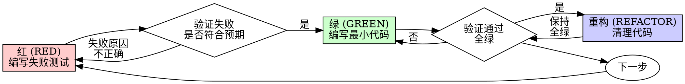

# 测试驱动开发 (TDD)

## 概述

先写测试。观察它失败。编写最小化的代码使其通过。

**核心原则：** 如果你没有看到测试失败，你就不知道它是否测试了正确的东西。

**违反规则的字面意思即是违反规则的精神。**

## 何时使用

**始终执行：**
- 新功能开发
- Bug 修复
- 代码重构
- 行为变更

**例外情况（需征得人类伙伴同意）：**
- 抛弃型原型 (Throwaway prototypes)
- 自动生成的代码
- 配置文件

产生“就这一次跳过 TDD”的想法？停。那是辩解。

## 铁律

```
没有失败的测试，绝不编写生产代码
```

先写了代码后写测试？删掉它。重新开始。

**绝无例外：**
- 不要保留它作为“参考”
- 不要在编写测试时“适配”它
- 不要去看它
- 删除意味着彻底删除

基于测试重新实现。句号。

## 红-绿-重构 (Red-Green-Refactor)



### 红 (RED) - 编写失败测试

编写一个最小化的测试，展示预期的行为。

**正例 (Good)：**
```typescript
test('失败的操作重试 3 次', async () => {
  let attempts = 0;
  const operation = () => {
    attempts++;
    if (attempts < 3) throw new Error('fail');
    return 'success';
  };

  const result = await retryOperation(operation);

  expect(result).toBe('success');
  expect(attempts).toBe(3);
});
```
名称清晰，测试真实行为，专注单一职责。

**反例 (Bad)：**
```typescript
test('重试机制有效', async () => {
  const mock = jest.fn()
    .mockRejectedValueOnce(new Error())
    .mockRejectedValueOnce(new Error())
    .mockResolvedValueOnce('success');
  await retryOperation(mock);
  expect(mock).toHaveBeenCalledTimes(3);
});
```
名称模糊，测试的是 Mock 对象而非代码逻辑。

**要求：**
- 单一行为。
- 名称清晰。
- 真实代码（除非不可避免，否则不要使用 Mock）。

### 验证红 (Verify RED) - 观察它失败

**强制性步骤。绝不跳过。**

```bash
npm test path/to/test.test.ts
```

确认：
- 测试失败（而不是运行报错）。
- 失败消息符合预期。
- 失败是因为功能缺失（而不是拼写错误）。

**测试通过了？** 说明你在测试现有的行为。请修改测试。

**测试报错了？** 修复报错，重新运行直到它正确地失败。

### 绿 (GREEN) - 编写最小化代码

编写能使测试通过的最简单的代码。

**正例 (Good)：**
```typescript
async function retryOperation<T>(fn: () => Promise<T>): Promise<T> {
  for (let i = 0; i < 3; i++) {
    try {
      return await fn();
    } catch (e) {
      if (i === 2) throw e;
    }
  }
  throw new Error('unreachable');
}
```
恰好能通过测试。

**反例 (Bad)：**
```typescript
async function retryOperation<T>(
  fn: () => Promise<T>,
  options?: {
    maxRetries?: number;
    backoff?: 'linear' | 'exponential';
    onRetry?: (attempt: number) => void;
  }
): Promise<T> {
  // 你不需要它 (YAGNI)
}
```
过度设计。

不要添加测试之外的功能、重构其他代码或进行额处的“改进”。

### 验证绿 (Verify GREEN) - 观察它通过

**强制性步骤。**

```bash
npm test path/to/test.test.ts
```

确认：
- 测试通过。
- 其他测试依然通过。
- 输出保持整洁（无错误、无警告）。

**测试失败了？** 修复代码，而不是修改测试。

**其他测试失败了？** 立即修复。

### 重构 (REFACTOR) - 清理代码

仅在全绿之后进行：
- 消除重复。
- 优化命名。
- 提取辅助函数。

确保测试保持绿色。不要添加新行为。

### 重复循环

为下一个功能编写下一个失败测试。

## 什么是好的测试

| 质量 | 正例 (Good) | 反例 (Bad) |
|---------|------|-----|
| **最小化** | 只做一件事。名称中有 "and"？拆分它。 | `test('验证邮件和域名及空白符')` |
| **清晰** | 名称描述行为 | `test('测试1')` |
| **展示意图** | 展示预期的 API 调用方式 | 掩盖了代码原本该做什么 |

## 为什么顺序很重要

**“我打算事后再写测试来验证功能。”**

事后编写的测试会立即通过。立即通过证明不了任何东西：
- 可能测试了错误的东西。
- 可能测试的是实现细节，而不是行为。
- 可能漏掉了你遗忘的边缘情况。
- 你从未见过它捕获过 Bug。

“测试先行”强制你观察测试失败，从而证明它确实测试了某些东西。

**“我已经手动测试了所有的边缘情况。”**

手动测试是随性的。你以为测试了一切，但：
- 没有你测试过什么的记录。
- 代码更改时无法重新运行。
- 在压力下容易遗漏。
- “我试的时候是好的” ≠ 全面。

自动化测试是系统性的。它们每次运行的方式都完全相同。

**“删除 X 小时的工作太浪费了。”**

沉没成本谬误。时间已经流逝了。你现在的选择是：
- 删除并使用 TDD 重写（多花 X 小时，高置信度）。
- 保留现状并事后补测（30 分钟，低置信度，可能有潜在 Bug）。

真正的“浪费”是保留你无法信任的代码。没有真实测试的运行代码是技术债。

**“TDD 太教条了，务实意味着要灵活。”**

TDD **就是**务实：
- 在提交前发现 Bug（比事后调试更快）。
- 防止回归（测试能立即捕获破坏）。
- 记录行为（测试展示了如何使用代码）。
- 支持重构（自由修改，测试会护航）。

“务实”的捷径 = 在生产环境中调试 = 更慢。

**“事后测试能达到同样目标——重要的是精神而非仪式。”**

并非如此。事后测试回答的是“这做了什么？”，而测试先行回答的是“这应该做什么？”。

事后测试会受到你实现方式的偏见影响。你测试的是你构建出来的东西，而不是被要求的。你验证的是你记住的边缘情况，而不是你发现的。

测试先行会在实现之前强迫你发现边缘情况。事后测试只是验证你记住了每件事（但实际上你没有）。

事后补测 30 分钟 ≠ TDD。你得到了覆盖率，却失去了测试有效的证明。

## 常见的辩解理由

| 借口 | 现实情况 |
|--------|---------|
| “太简单了，不需要测” | 简单的代码也会坏。测试只需 30 秒。 |
| “我稍后会测” | 立即通过的测试证明不了任何东西。 |
| “事后测试能达到同样目标” | 事后测试 = “这做了什么？” 先行测试 = “这应该做什么？” |
| “已经手动测试过了” | 随性 ≠ 系统。无记录，不可重复。 |
| “删除 X 小时太浪费了” | 沉没成本谬误。保留未经验证的代码是技术债。 |
| “保留作为参考，先写测试” | 你会忍不住去适配它。那是事后测试。删除意味着彻底删除。 |
| “需要先进行探索” | 没问题。把探索的代码扔掉，从 TDD 开始正式实现。 |
| “测试太难 = 设计不清晰” | 听听测试的声音。难测 = 难用。 |
| “TDD 会拖慢我的速度” | TDD 比调试快。务实 = 先行测试。 |
| “手动测试更快” | 手动无法证明边缘情况。每次改动你都要重测。 |
| “现有代码没有测试” | 你正在改进它。请为现有代码添加测试。 |

## 红灯信号 - 停止并重新开始

- 先写代码后写测试
- 实现后再写测试
- 测试立即通过
- 无法解释测试为什么失败
- “稍后”才添加测试
- 寻找“就这一次”的辩解
- “我已经手动测试过了”
- “事后测试能达到同样目的”
- “重要的是精神而非仪式”
- “保留作为参考”或“尝试适配现有代码”
- “已经花了 X 小时，删除太浪费了”
- “TDD 太教条，我很务实”
- “这次情况不同，因为……”

**所有这些都意味着：删除代码。使用 TDD 重新开始。**

## 示例：Bug 修复

**Bug：** 接受了空的 Email

**红 (RED)**
```typescript
test('拒绝空 Email', async () => {
  const result = await submitForm({ email: '' });
  expect(result.error).toBe('Email required');
});
```

**验证红 (Verify RED)**
```bash
$ npm test
FAIL: expected 'Email required', got undefined
```

**绿 (GREEN)**
```typescript
function submitForm(data: FormData) {
  if (!data.email?.trim()) {
    return { error: 'Email required' };
  }
  // ...
}
```

**验证绿 (Verify GREEN)**
```bash
$ npm test
PASS
```

**重构 (REFACTOR)**
如有需要，提取多字段校验逻辑。

## 验证清单

在标记任务完成前：

- [ ] 每一个新函数/方法都有对应测试。
- [ ] 在实现前观察到每一个测试失败。
- [ ] 每个测试都由于预期原因失败（功能缺失，而非拼写错误）。
- [ ] 为每个测试编写了最少化的代码。
- [ ] 所有测试通过。
- [ ] 输出整洁（无错误、无警告）。
- [ ] 测试使用的是真实代码（除非不可避免，否则不要用 Mock）。
- [ ] 覆盖了边缘情况和错误处理。

无法完全勾选？说明你跳过了 TDD。请重新开始。

## 遇到困难时

| 问题 | 解决方案 |
|---------|----------|
| 不知道怎么测 | 编写理想中的 API。先写基准断言。询问人类伙伴。 |
| 测试太复杂 | 设计太复杂。简化接口。 |
| 必须 Mock 所有东西 | 代码耦合度过高。使用依赖注入。 |
| 测试设置 (Setup) 巨大 | 提取辅助函数。仍然复杂？简化设计。 |

## 调试与集成

发现 Bug？编写能重现它的失败测试。遵循 TDD 循环。测试既能证明修复有效，也能防止回归。

绝不修复一个没有测试证明的 Bug。

## 测试反模式

在添加 Mock 或测试工具时，请阅读 `@testing-anti-patterns.md` 以避免常见陷阱：
- 测试 Mock 行为而非真实行为。
- 向生产类添加仅用于测试的方法。
- 在不理解依赖的情况下滥用 Mock。

## 终极法则

```
生产代码 -> 测试存在且预先失败
否则 -> 不是 TDD
```

未经人类伙伴允许，绝无例外。
