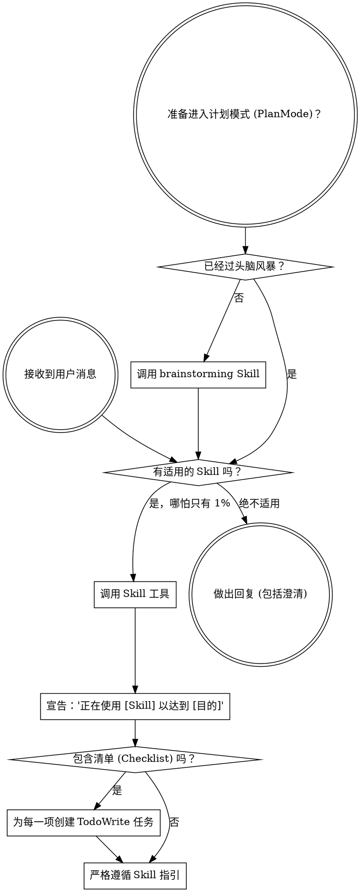

<SUBAGENT-STOP>
如果你是作为子 Agent (Subagent) 被派发来执行特定任务的，请跳过此 Skill。
</SUBAGENT-STOP>

<EXTREMELY-IMPORTANT>
如果你认为某个 Skill 哪怕只有 1% 的可能性适用于你正在做的事情，你也**绝对必须**调用该 Skill。

如果某个 Skill 适用于你的任务，你没有选择的余地。你必须使用它。

这是不可逾越的底线。这不是可选的。你不能寻找任何辩解理由来逃避。
</EXTREMELY-IMPORTANT>

## 指令优先级

Superpowers 系列 Skill 会覆盖默认的系统提示词行为，但**用户的指令始终具有最高优先级**：

1. **用户的明确指令** (`CLAUDE.md`, `GEMINI.md`, `AGENTS.md`，或直接请求) —— 最高优先级。
2. **Superpowers Skills** —— 在冲突时覆盖默认系统行为。
3. **默认系统提示词** —— 最低优先级。

如果 `CLAUDE.md`、`GEMINI.md` 或 `AGENTS.md` 说“不要使用 TDD”，而某个 Skill 说“始终使用 TDD”，请遵循用户的指令。用户拥有最终控制权。

## 如何访问 Skill

**在 Claude Code 中：** 使用 `Skill` 工具。当你调用一个 Skill 时，其内容会被加载并呈现给你 —— 请直接遵循它。绝不要对 Skill 文件使用 Read 工具。

**在 Gemini CLI 中：** 通过 `activate_skill` 工具激活。Gemini 会在会话开始时加载 Skill 元数据，并根据需要激活完整内容。

**在其他环境中：** 请查阅你所在平台的文档，了解 Skill 是如何加载的。

## 平台适配

Skill 中使用的工具名称通常基于 Claude Code。非 CC 平台：请参考 `references/codex-tools.md` (Codex) 获取对应的工具映射。Gemini CLI 用户会自动通过 `GEMINI.md` 加载工具映射。

# 使用 Skill

## 准则

**在做出任何回复或采取任何行动之前，先调用相关或被要求的 Skill。** 哪怕只有 1% 的可能性适用，也应该调用该 Skill 进行检查。如果调用的 Skill 最终证明不适合当前情况，你无需继续使用它。

## 红灯信号

出现以下想法意味着你正在“寻找辩解” —— 必须立即**停止**：

| 想法 | 现实情况 |
|---------|---------|
| “这只是一个简单的问题” | 问题也是任务。请检查是否有适用的 Skill。 |
| “我需要先了解更多上下文” | 检查 Skill 应优先于提出澄清问题。 |
| “让我先探索一下代码库” | Skill 会告诉你**如何**探索。请先检查。 |
| “我可以快速检查下 Git/文件” | 文件缺乏对话上下文。请检查是否有适用的 Skill。 |
| “让我先搜集一下信息” | Skill 会告诉你**如何**搜集信息。 |
| “这不需要正式的 Skill” | 如果存在对应的 Skill，就请使用它。 |
| “我记得这个 Skill” | Skill 在不断演进。请阅读当前版本。 |
| “这不算是一项任务” | 任何行动都是任务。请检查是否有适用的 Skill。 |
| “这个 Skill 有点杀鸡用牛刀” | 简单的事情也会变复杂。请使用它。 |
| “我先做这一件小事” | 在做任何事情**之前**，先检查 Skill。 |
| “这感觉效率很高” | 不受约束的行为是浪费时间。Skill 能防止这种情况。 |
| “我知道那是什么意思” | 了解概念 ≠ 使用了该 Skill。请调用它。 |

## Skill 优先级

当多个 Skill 同时适用时，请按此顺序使用：

1. **流程类 Skill 优先**（头脑风暴、调试） —— 这些决定了**如何**着手处理任务。
2. **实施类 Skill 随后**（前端设计、MCP 构建） —— 这些指导具体的执行。

“我们来构建 X” -> 先进行头脑风暴，然后再使用具体的实施类 Skill。
“修复这个 Bug” -> 先进行调试分析，然后再使用特定领域的 Skill。

## Skill 类型

**刚性型 (Rigid)**（TDD、调试）：严格遵循。不要因图方便而削弱纪律。

**灵活型 (Flexible)**（模式）：根据上下文灵活应用其中的原则。

Skill 本身会告诉你它属于哪种类型。

## 用户指令

指令告诉你“做什么”，而不是“怎么做”。“添加 X”或“修复 Y”并不意味着跳过工作流程。
