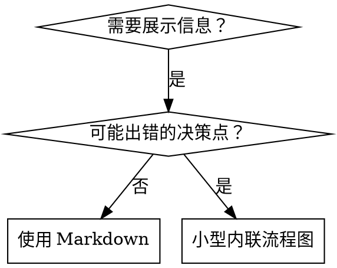

# 编写 Skill (Writing Skills)

## 概述

**编写 Skill 就是将“test-driven-development (TDD)”应用于流程文档。**

**个人 Skill 存储在特定 Agent 的目录中（Claude Code 为 `~/.claude/skills`，Codex 为 `~/.agents/skills/`）** 

你需要编写测试用例（使用子 Agent 的压力场景），观察它们失败（基准行为），编写 Skill（文档），观察测试通过（Agent 遵守规范），然后重构（堵住漏洞）。

**核心原则：** 如果你没有看到 Agent 在没有 Skill 的情况下失败，你就不知道这个 Skill 是否教导了正确的东西。

**必备背景：** 在使用此 Skill 之前，你必须理解 `superpowers:test-driven-development`。该 Skill 定义了基本的“红-绿-重构 (RED-GREEN-REFACTOR)”循环。此 Skill 将 TDD 适配到文档编写中。

**官方指南：** 有关 Anthropic 官方的 Skill 编写最佳实践，请参阅 `anthropic-best-practices.md`。该文档提供了补充本 Skill 中 TDD 方法的其他模式和指南。

## 什么是 Skill？

**Skill** 是关于成熟技术、模式或工具的参考指南。Skill 帮助未来的 Claude 实例找到并应用有效的方法。

**Skill 是：** 可重用的技术、模式、工具、参考指南。

**Skill 不是：** 关于你曾经如何解决某个问题的叙述。

## Skill 的 TDD 映射

| TDD 概念 | Skill 创建 |
|-------------|----------------|
| **测试用例** | 使用子 Agent 的压力场景 |
| **生产代码** | Skill 文档 (`SKILL.md`) |
| **测试失败 (红)** | Agent 在没有 Skill 的情况下违反规则（基准） |
| **测试通过 (绿)** | Agent 在有 Skill 的情况下遵守规范 |
| **重构** | 在保持合规性的同时堵住漏洞 |
| **先写测试** | 在编写 Skill 之前运行基准场景 |
| **观察失败** | 记录 Agent 使用的确切辩解理由 |
| **最小代码** | 编写针对这些特定违规行为的 Skill 内容 |
| **观察通过** | 验证 Agent 现在是否合规 |
| **重构循环** | 发现新的辩解 -> 堵漏 -> 重新验证 |

整个 Skill 创建过程遵循“红-绿-重构”循环。

## 什么时候创建 Skill

**在以下情况下创建：**
- 技术对你来说不是直观显见的
- 你会在不同项目中再次引用它
- 模式具有广泛适用性（非特定于项目）
- 他人能从中受益

**不要在以下情况下创建：**
- 一次性的解决方案
- 已在别处有详细记录的标准实践
- 特定于项目的约定（存放在 `CLAUDE.md` 中）
- 机械约束（如果可以用正则/验证来强制执行，则自动化它——将文档留给判断逻辑）

## Skill 类型

### 技术 (Technique)
包含可遵循步骤的具体方法（基于条件的等待、根因追踪）。

### 模式 (Pattern)
思考问题的方式（用标志位展平、测试不变性）。

### 参考 (Reference)
API 文档、语法指南、工具文档（办公文档）。

## 目录结构

```
skills/
  skill-name/
    SKILL.md              # 主参考文档 (必需)
    supporting-file.*     # 仅在需要时提供
```

**扁平命名空间** - 所有 Skill 都在一个可搜索的命名空间中。

**以下内容需独立成文件：**
1. **重度参考** (100行以上) - API 文档、详尽的语法。
2. **可重用工具** - 脚本、实用程序、模板。

**以下内容应保持内联：**
- 原则和概念。
- 代码模式 (小于 50 行)。
- 其他所有内容。

## SKILL.md 结构

**前言 (YAML):**
- 两个必需字段：`name` 和 `description`（有关所有支持的字段，请参阅 [agentskills.io/specification](https://agentskills.io/specification)）。
- 总计最多 1024 个字符。
- `name`: 仅使用字母、数字和连字符（不含括号、特殊字符）。
- `description`: 第三人称，仅描述**何时使用**（而不是它做什么）。
  - 以“在...时使用” (Use when...) 开头，专注于触发条件。
  - 包含特定的症状、情况和上下文。
  - **绝不总结 Skill 的流程或工作流**（原因见下文 CSO 部分）。
  - 尽量控制在 500 个字符以内。

```markdown
---
name: Skill-Name-With-Hyphens
description: 在 [特定的触发条件和症状] 时使用
---

# Skill 名称

## 概述
这是什么？用 1-2 句话说明核心原则。

## 何时使用
[如果决策不显见，提供小型内联流程图]

带有症状和用例的列表
何时**不**使用

## 核心模式 (针对技术/模式)
代码对比（重构前/后）

## 快速参考
用于扫描常用操作的表格或列表

## 实施
简单模式使用内联代码
重度参考或可重用工具链接到文件

## 常见错误
哪里会出错 + 修复方案

## 实际影响 (可选)
具体结果
```

## Claude 搜索优化 (CSO)

**对于发现至关重要：** 未来的 Claude 需要能够**找到**你的 Skill。

### 1. 丰富的描述字段

**目的：** Claude 通过阅读描述来决定为给定任务加载哪些 Skill。让它回答：“我现在应该阅读这个 Skill 吗？”

**格式：** 以“在...时使用”开头，专注于触发条件。

**至关重要：描述 = 何时使用，而不是 Skill 做什么**

描述应**仅**描述触发条件。不要在描述中总结 Skill 的流程或工作流。

**为什么这很重要：** 测试表明，当描述总结了 Skill 的工作流时，Claude 可能会遵循描述而不是阅读完整的 Skill 内容。一个描述说“任务之间的代码审查”会导致 Claude 仅执行一次审查，尽管 Skill 的流程图清晰显示了两次审查（规范合规性审查，然后是代码质量审查）。

当描述改为“在当前会话中执行具有独立任务的实施计划时使用”（无工作流总结）时，Claude 正确阅读了流程图并遵循了两阶段审查过程。

**陷阱：** 总结工作流的描述会创建 Claude 可能采取的捷径。Skill 正文变成了 Claude 跳过的文档。

```yaml
# ❌ 错误：总结了工作流 - Claude 可能遵循此描述而非阅读 Skill
description: 在执行计划时使用 - 为每个任务分配子 Agent，并在任务之间进行代码审查

# ❌ 错误：过多的过程细节
description: 用于 TDD - 先写测试，观察失败，编写最小代码，重构

# ✅ 正确：仅触发条件，无工作流总结
description: 在当前会话中执行具有独立任务的实施计划时使用

# ✅ 正确：仅触发条件
description: 在实现任何功能或修复 Bug 之前，编写实现代码前使用
```

**内容要求：**
- 使用具体的触发器、症状和信号来表明此 Skill 适用。
- 描述**问题**（竞态条件、行为不一致），而不是**特定于语言的症状**（setTimeout、sleep）。
- 保持触发器与技术无关，除非 Skill 本身是特定于技术的。
- 如果 Skill 是特定于技术的，在触发器中明确说明。
- 使用第三人称编写（注入系统提示词）。
- **绝不总结 Skill 的流程或工作流。**

```yaml
# ❌ 错误：太抽象、模糊，未包含何时使用
description: 用于异步测试

# ❌ 错误：第一人称
description: 当异步测试不稳定时，我可以帮助你

# ❌ 错误：提到技术但 Skill 并非特定于该技术
description: 在测试使用 setTimeout/sleep 且不稳定时使用

# ✅ 正确：以“在...时使用”开头，描述问题，无工作流
description: 在测试存在竞态条件、时序依赖或通过/失败不一致时使用

# ✅ 正确：具有明确触发器的特定技术 Skill
description: 在使用 React Router 并处理身份验证重定向时使用
```

### 2. 关键词覆盖

使用 Claude 会搜索的词汇：
- 错误消息："Hook timed out", "ENOTEMPTY", "race condition"
- 症状："flaky" (不稳定), "hanging" (卡住), "zombie" (僵死), "pollution" (污染)
- 同义词："timeout/hang/freeze", "cleanup/teardown/afterEach"
- 工具：实际命令、库名称、文件类型

### 3. 描述性命名

**使用主动语态，动词优先：**
- ✅ `creating-skills` 而非 `skill-creation`
- ✅ `condition-based-waiting` 而非 `async-test-helpers`

### 4. Token 效率 (至关重要)

**问题：** 入门和频繁引用的 Skill 会加载到**每一次**对话中。每一个 Token 都很重要。

**目标词数：**
- 入门工作流：每个 < 150 词
- 频繁加载的 Skill：总计 < 200 词
- 其他 Skill：< 500 词（仍需简洁）

**技术手段：**

**将细节移至工具帮助：**
```bash
# ❌ 错误：在 SKILL.md 中记录所有标志
search-conversations 支持 --text, --both, --after DATE, --before DATE, --limit N

# ✅ 正确：引用 --help
search-conversations 支持多种模式 and 过滤器。运行 --help 查看详情。
```

**使用交叉引用：**
```markdown
# ❌ 错误：重复工作流细节
搜索时，使用模板派生子 Agent...
[20 行重复指令]

# ✅ 正确：引用其他 Skill
始终使用子 Agent（可节省 50-100 倍上下文）。强制要求：使用 [其他-skill-名称] 进行工作流。
```

**压缩示例：**
```markdown
# ❌ 错误：冗长的示例 (42 词)
人类伙伴：“我们以前是如何在 React Router 中处理身份验证错误的？”
你：我会搜索过去的对话，寻找 React Router 的身份验证模式。
[派生子 Agent，搜索查询为：“React Router authentication error handling 401”]

# ✅ 正确：最小示例 (20 词)
伙伴：“React Router 怎么处理验证错误？”
你：正在搜索...
[派生子 Agent -> 综合汇总]
```

**消除冗余：**
- 不要重复交叉引用 Skill 中的内容。
- 不要解释命令中显而易见的内容。
- 不要为同一种模式包含多个示例。

**验证：**
```bash
wc -w skills/path/SKILL.md
# 入门工作流：目标词数 < 150
# 其他频繁加载的：目标词数总计 < 200
```

**按所做的动作或核心洞察命名：**
- ✅ `condition-based-waiting` > `async-test-helpers`
- ✅ `using-skills` 而非 `skill-usage`
- ✅ `flatten-with-flags` > `data-structure-refactoring`
- ✅ `root-cause-tracing` > `debugging-techniques`

**动名词 (-ing) 非常适合描述过程：**
- `creating-skills`, `testing-skills`, `debugging-with-logs`
- 主动语态，描述你正在采取的行动。

### 4. 交叉引用其他 Skill

**在编写引用其他 Skill 的文档时：**

仅使用 Skill 名称，并带有明确的强制要求标记：
- ✅ 正确：`**强制子 Skill：** 使用 superpowers:test-driven-development`
- ✅ 正确：`**必备背景：** 你必须理解 superpowers:systematic-debugging`
- ❌ 错误：`参见 skills/testing/test-driven-development`（不清楚是否必需）
- ❌ 错误：`@skills/testing/test-driven-development/SKILL.md`（强制加载，白白消耗上下文）

**为什么不使用 @ 链接：** `@` 语法会立即强制加载文件，在需要之前就会消耗掉 200k+ 的上下文。

## 流程图用法



**仅在以下情况使用流程图：**
- 非显而易见的决策点。
- 可能过早停止的流程循环。
- “何时使用 A vs B”的决策。

**绝不将流程图用于：**
- 参考资料 -> 使用表格、列表。
- 代码示例 -> 使用 Markdown 块。
- 线性指令 -> 使用编号列表。
- 无语义含义的标签（step1, helper2）。

参见 `@graphviz-conventions.dot` 了解 Graphviz 样式规则。

**为人类伙伴可视化：** 使用此目录下的 `render-graphs.js` 将 Skill 的流程图渲染为 SVG：
```bash
./render-graphs.js ../some-skill           # 每个图表单独渲染
./render-graphs.js ../some-skill --combine # 所有图表合并为一个 SVG
```

## 代码示例

**一个优秀的示例胜过许多平庸的示例**

选择最相关的语言：
- 测试技术 -> TypeScript/JavaScript
- 系统调试 -> Shell/Python
- 数据处理 -> Python

**优秀的示例：**
- 完整且可运行。
- 注释详细，解释了“为什么”。
- 源自真实场景。
- 清晰展示模式。
- 易于适配（而非通用模板）。

**不要：**
- 用 5 种以上语言实现。
- 创建填空式模板。
- 编写做作的示例。

你擅长移植——一个伟大的示例就足够了。

## 文件组织

### 自给自足的 Skill
```
defense-in-depth/
  SKILL.md    # 所有内容内联
```
适用场景：所有内容都能放下，无需重度参考。

### 带有可重用工具的 Skill
```
condition-based-waiting/
  SKILL.md    # 概述 + 模式
  example.ts  # 可供适配的运行辅助工具
```
适用场景：工具是可重用的代码，而非仅仅是叙述。

### 带有重度参考的 Skill
```
pptx/
  SKILL.md       # 概述 + 工作流
  pptxgenjs.md   # 600 行 API 参考
  ooxml.md       # 500 行 XML 结构
  scripts/       # 可执行工具
```
适用场景：参考资料太大，无法内联。

## 铁律 (同 TDD)

```
没有失败的测试，绝不编写 SKILL
```

这适用于**新** Skill 以及对**现有** Skill 的修改。

在测试前编写了 Skill？删掉它。重新开始。
在没有测试的情况下编辑了 Skill？同样的违规。

**绝无例外：**
- 不适用于“简单的补充”。
- 不适用于“仅仅添加一个章节”。
- 不适用于“文档更新”。
- 不要保留未经测试的更改作为“参考”。
- 不要在运行测试时进行“适配”。
- 删除意味着彻底删除。

**必备背景：** `superpowers:test-driven-development` 解释了这为什么很重要。同样的原则适用于文档。

## 测试所有 Skill 类型

不同类型的 Skill 需要不同的测试方法：

### 强制纪律类 Skill (规则/要求)

**示例：** TDD, 完成前验证, 编码前设计。

**测试手段：**
- 理论提问：他们理解规则吗？
- 压力场景：他们在压力下合规吗？
- 多重压力组合：时间 + 沉没成本 + 疲劳。
- 识别辩解理由并添加明确的反制措施。

**成功标准：** Agent 在最大压力下仍遵循规则。

### 技术类 Skill (操作指南)

**示例：** 基于条件的等待, 根因追踪, 防御性编程。

**测试手段：**
- 应用场景：他们能正确应用该技术吗？
- 变化场景：他们能处理边缘情况吗？
- 信息缺失测试：指令是否有漏洞？

**成功标准：** Agent 成功将技术应用于新场景。

### 模式类 Skill (思维模型)

**示例：** 降低复杂性, 信息隐藏概念。

**测试手段：**
- 识别场景：他们能识别模式适用时机吗？
- 应用场景：他们能使用该思维模型吗？
- 反面示例：他们知道什么时候**不**适用吗？

**成功标准：** Agent 正确识别何时/如何应用模式。

### 参考类 Skill (文档/API)

**示例：** API 文档, 命令参考, 库指南。

**测试手段：**
- 检索场景：他们能找到正确信息吗？
- 应用场景：他们能正确使用找到的信息吗？
- 缺口测试：常见用例是否覆盖？

**成功标准：** Agent 找到并正确应用参考信息。

## 跳过测试的常见辩解

| 借口 | 现实情况 |
|--------|---------|
| “Skill 显然很清晰” | 对你清晰 ≠ 对其他 Agent 清晰。测试它。 |
| “这只是参考” | 参考文档也可能有缺口或不清晰的部分。测试检索。 |
| “测试太麻烦了” | 未经测试的 Skill 肯定有问题。始终如此。15 分钟测试能节省数小时。 |
| “如果有问题我再测试” | 有问题 = Agent 无法使用 Skill。部署**前**测试。 |
| “测试起来太枯燥” | 测试总比在生产环境中调试糟糕的 Skill 省事。 |
| “我有信心它很好” | 过度自信必然导致出问题。无论如何都要测试。 |
| “理论审查就够了” | 阅读 ≠ 使用。测试应用场景。 |
| “没时间测试” | 部署未经测试的 Skill 以后会浪费更多时间修复它。 |

**所有这些都意味着：部署前必须测试。绝无例外。**

## 防弹化 Skill：对抗辩解

强制纪律的 Skill（如 TDD）需要能够抵抗辩解。Agent 很聪明，在压力下会寻找漏洞。

**心理学笔记：** 了解说服技术背后的**原理**能帮助你系统地应用它们。参见 `persuasion-principles.md` 了解关于权威、承诺、稀缺性、社会认同和一致性原则的研究基础（Cialdini, 2021; Meincke et al., 2025）。

### 明确堵住每一个漏洞

不要只陈述规则——要禁止具体的变通方法：

<错误写法>
```markdown
先写代码后写测试？删掉它。
```
</错误写法>

<正确写法>
```markdown
先写代码后写测试？删掉它。重新开始。

**绝无例外：**
- 不要保留它作为“参考”。
- 不要在编写测试时“适配”它。
- 不要去看它。
- 删除意味着彻底删除。
```
</正确写法>

### 应对“精神 vs 字面”争论

及早添加基本原则：

```markdown
**违反规则的字面意思即是违反规则的精神。**
```

这切断了所有“我遵循的是精神”这种辩解。

### 建立辩解映射表

从基准测试中捕获辩解理由（见下文测试章节）。Agent 提出的每一个借口都要存入表中：

```markdown
| 借口 | 现实情况 |
|--------|---------|
| “太简单了，不需要测试” | 简单的代码也会坏。测试只需 30 秒。 |
| “我稍后会测” | 立即通过的测试证明不了任何东西。 |
| “事后测试能达到同样目标” | 事后测试 = “这做了什么？” 先行测试 = “这应该做什么？” |
```

### 创建红灯清单

让 Agent 在产生辩解倾向时更容易自检：

```markdown
## 红灯信号 - 停止并重新开始

- 先写代码后测
- “我已经手动测试过了”
- “事后测试能达到同样目的”
- “重要的是精神而非仪式”
- “这次情况不同，因为……”

**所有这些都意味着：删除代码。使用 TDD 重新开始。**
```

### 为违规症状优化 CSO

在描述中添加：关于你**即将**违反规则的症状描述：

```yaml
description: 在实现任何功能或修复 Bug 之前，编写实现代码前使用
```

## Skill 的红-绿-重构 (RED-GREEN-REFACTOR)

遵循 TDD 循环：

### 红 (RED): 编写失败测试 (基准)

在**没有** Skill 的情况下，使用子 Agent 运行压力场景。记录确切行为：
- 他们做了什么选择？
- 他们使用了什么辩解（原文记录）？
- 哪些压力触发了违规？

这就是“观察测试失败”——你在编写 Skill 前必须先看 Agent 自然会怎么做。

### 绿 (GREEN): 编写最小化 Skill

编写针对这些特定辩解理由的 Skill 内容。不要针对假设情况添加额外内容。

在**有** Skill 的情况下运行相同的场景。Agent 现在应该合规。

### 重构 (REFACTOR): 堵住漏洞

Agent 找到了新的辩解理由？添加明确的反制措施。重新测试直到无懈可击。

**测试方法论：** 参见 `@testing-skills-with-subagents.md` 了解完整的测试方法：
- 如何编写压力场景。
- 压力类型（时间、沉没成本、权威、疲劳）。
- 系统地补洞。
- 元测试技术。

## 反模式 (Anti-Patterns)

### ❌ 叙事性示例
“在 2025-10-03 的会话中，我们发现 projectDir 为空导致了……”
**原因：** 太过具体，无法重用。

### ❌ 多语言稀释
example-js.js, example-py.py, example-go.go
**原因：** 质量平庸，维护负担大。

### ❌ 在流程图中写代码
```dot
step1 [label="import fs"];
step2 [label="read file"];
```
**原因：** 无法复制粘贴，难以阅读。

### ❌ 通用标签
helper1, helper2, step3, pattern4
**原因：** 标签应具有语义含义。

## 停止：在进行下一个 Skill 之前

**在编写完成任何 Skill 后，你必须停止并完成部署流程。**

**不要：**
- 在没有测试每一个 Skill 的情况下批量创建多个 Skill。
- 在当前 Skill 未经验证前就转向下一个。
- 因为“批量处理效率更高”而跳过测试。

**下方的部署清单对每一个 Skill 都是强制性的。**

部署未经测试 com 发布的 Skill = 部署未经测试的代码。这是对质量标准的违反。

## Skill 创建清单 (适配自 TDD)

**重要：必须调用原生的 `TodoWrite` 工具为下方的每一个清单项创建待办任务。**

**红阶段 (RED) - 编写失败测试：**
- [ ] 创建压力场景（针对纪律类 Skill 需组合 3 种以上压力）。
- [ ] 在没有 Skill 的情况下运行场景——原文记录基准行为。
- [ ] 识别辩解/失败中的模式。

**绿阶段 (GREEN) - 编写最小化 Skill：**
- [ ] 名称仅包含字母、数字、连字符（无括号/特殊字符）。
- [ ] 带有必需字段 `name` 和 `description` 的 YAML 前言（最多 1024 字符；参见 [规范](https://agentskills.io/specification)）。
- [ ] 描述以“在...时使用”开头，包含特定的触发器/症状。
- [ ] 描述使用第三人称。
- [ ] 全文包含可供搜索的关键词（错误、症状、工具）。
- [ ] 带有核心原则的清晰概述。
- [ ] 解决红阶段识别出的特定基准失败。
- [ ] 代码内联或链接到独立文件。
- [ ] 一个优秀的示例（非多语言）。
- [ ] 在有 Skill 的情况下运行场景——验证 Agent 现在合规。

**重构阶段 (REFACTOR) - 堵住漏洞：**
- [ ] 从测试中识别新的辩解理由。
- [ ] 添加明确的反制措施（如果是纪律类 Skill）。
- [ ] 根据所有测试迭代建立辩解映射表。
- [ ] 创建红灯清单。
- [ ] 重新测试直到无懈可击。

**质量检查：**
- [ ] 仅在决策不显见时提供小型流程图。
- [ ] 快速参考表。
- [ ] 常见错误章节。
- [ ] 无叙事性讲故事。
- [ ] 支撑文件仅用于工具或重度参考。

**部署：**
- [ ] 将 Skill 提交至 Git 并推送到你的分支（如果已配置）。
- [ ] 如果具有广泛实用性，考虑通过 PR 贡献回去。

## 发现工作流 (Discovery Workflow)

未来的 Claude 如何找到你的 Skill：

1. **遇到问题**（“测试不稳定”）。
2. **发现 SKILL**（描述匹配）。
3. **扫描概述**（这相关吗？）。
4. **阅读模式**（快速参考表）。
5. **加载示例**（仅在实施时）。

**为此流程进行优化**——尽早且经常放置可搜索的术语。

## 总结

**创建 Skill 就是流程文档的测试驱动开发 (TDD)。**

相同的铁律：没有失败测试，绝不编写 Skill。
相同的循环：红 (基准) -> 绿 (编写 Skill) -> 重构 (堵住漏洞)。
相同的益处：更好的质量、更少的意外、无懈可击的结果。

如果你在编写代码时遵循 TDD，那么在编写 Skill 时也请遵循它。这是将同样的严谨应用于文档编写。
