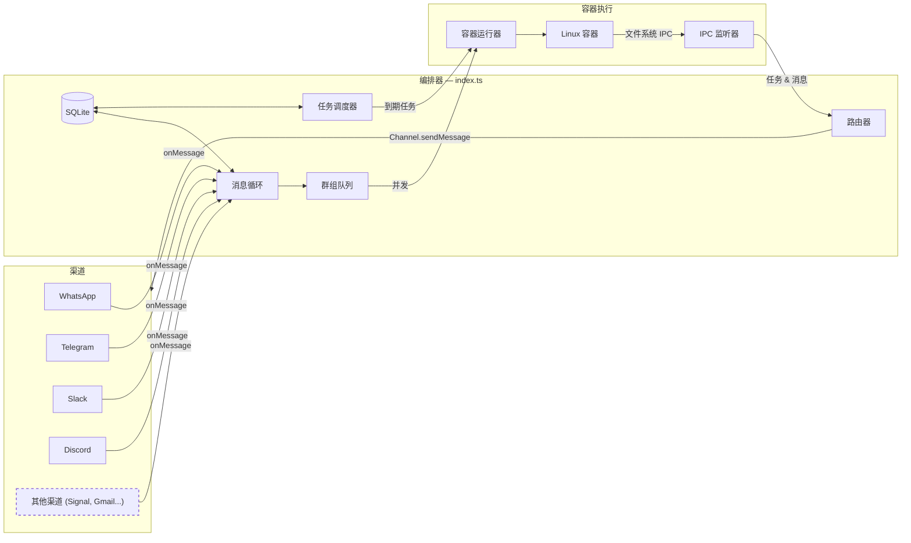

# NanoClaw 规格说明

一个具有多渠道支持、按对话持久化记忆、定时任务和容器隔离 agent 执行的个人 Claude 助手。

---

## 目录

1. [架构](#架构)
2. [架构：渠道系统](#架构渠道系统)
3. [文件夹结构](#文件夹结构)
4. [配置](#配置)
5. [记忆系统](#记忆系统)
6. [会话管理](#会话管理)
7. [消息流转](#消息流转)
8. [命令](#命令)
9. [定时任务](#定时任务)
10. [MCP 服务器](#mcp-服务器)
11. [部署](#部署)
12. [安全注意事项](#安全注意事项)

---

## 架构

```
┌──────────────────────────────────────────────────────────────────────┐
│                        宿主机 (macOS / Linux)                         │
│                     (主 Node.js 进程)                                  │
├──────────────────────────────────────────────────────────────────────┤
│                                                                       │
│  ┌──────────────────┐                  ┌────────────────────┐        │
│  │ 渠道             │─────────────────▶│   SQLite 数据库    │        │
│  │ (启动时           │◀────────────────│   (messages.db)    │        │
│  │  自注册)          │  存储/发送       └─────────┬──────────┘        │
│  └──────────────────┘                            │                   │
│                                                   │                   │
│         ┌─────────────────────────────────────────┘                   │
│         │                                                             │
│         ▼                                                             │
│  ┌──────────────────┐    ┌──────────────────┐    ┌───────────────┐   │
│  │  消息循环         │    │  调度器循环       │    │  IPC 监听器   │   │
│  │  (轮询 SQLite)    │    │  (检查任务)       │    │  (基于文件)   │   │
│  └────────┬─────────┘    └────────┬─────────┘    └───────────────┘   │
│           │                       │                                   │
│           └───────────┬───────────┘                                   │
│                       │ 启动容器                                      │
│                       ▼                                               │
├──────────────────────────────────────────────────────────────────────┤
│                     容器 (Linux VM)                                    │
├──────────────────────────────────────────────────────────────────────┤
│  ┌──────────────────────────────────────────────────────────────┐    │
│  │                    AGENT RUNNER                               │    │
│  │                                                                │    │
│  │  工作目录：/workspace/group（从宿主机挂载）                     │    │
│  │  卷挂载：                                                      │    │
│  │    • groups/{name}/ → /workspace/group                         │    │
│  │    • groups/global/ → /workspace/global/（非主群组）            │    │
│  │    • data/sessions/{group}/.claude/ → /home/node/.claude/      │    │
│  │    • 额外目录 → /workspace/extra/*                             │    │
│  │                                                                │    │
│  │  工具（所有群组）：                                             │    │
│  │    • Bash（安全 — 在容器中沙盒化！）                           │    │
│  │    • Read, Write, Edit, Glob, Grep（文件操作）                 │    │
│  │    • WebSearch, WebFetch（互联网访问）                          │    │
│  │    • agent-browser（浏览器自动化）                              │    │
│  │    • mcp__nanoclaw__*（通过 IPC 的调度器工具）                  │    │
│  │                                                                │    │
│  └──────────────────────────────────────────────────────────────┘    │
│                                                                       │
└───────────────────────────────────────────────────────────────────────┘
```

### 技术栈

| 组件 | 技术 | 用途 |
|------|------|------|
| 渠道系统 | 渠道注册表 (`src/channels/registry.ts`) | 渠道在启动时自注册 |
| 消息存储 | SQLite (better-sqlite3) | 存储消息以供轮询 |
| 容器运行时 | 容器（轻量级 Linux VM） | 为 agent 执行提供隔离环境 |
| Agent | @anthropic-ai/claude-agent-sdk (0.2.29) | 运行带工具和 MCP 服务器的 Claude |
| 浏览器自动化 | agent-browser + Chromium | 网页交互和截图 |
| 运行时 | Node.js 20+ | 用于路由和调度的宿主进程 |

---

## 架构：渠道系统

核心不内置任何渠道——每个渠道（WhatsApp、Telegram、Slack、Discord、Gmail）作为 [Claude Code 技能](https://code.claude.com/docs/en/skills) 安装，将渠道代码添加到你的 fork 中。渠道在启动时自注册；已安装但缺少凭据的渠道会发出 WARN 日志并被跳过。

### 系统图



### 渠道注册表

渠道系统基于 `src/channels/registry.ts` 中的工厂注册表构建：

```typescript
export type ChannelFactory = (opts: ChannelOpts) => Channel | null;

const registry = new Map<string, ChannelFactory>();

export function registerChannel(name: string, factory: ChannelFactory): void {
  registry.set(name, factory);
}

export function getChannelFactory(name: string): ChannelFactory | undefined {
  return registry.get(name);
}

export function getRegisteredChannelNames(): string[] {
  return [...registry.keys()];
}
```

每个工厂接收 `ChannelOpts`（包含 `onMessage`、`onChatMetadata` 和 `registeredGroups` 的回调）并返回一个 `Channel` 实例，如果该渠道的凭据未配置则返回 `null`。

### 渠道接口

每个渠道实现此接口（定义在 `src/types.ts` 中）：

```typescript
interface Channel {
  name: string;
  connect(): Promise<void>;
  sendMessage(jid: string, text: string): Promise<void>;
  isConnected(): boolean;
  ownsJid(jid: string): boolean;
  disconnect(): Promise<void>;
  setTyping?(jid: string, isTyping: boolean): Promise<void>;
  syncGroups?(force: boolean): Promise<void>;
}
```

### 自注册模式

渠道使用桶导入模式自注册：

1. 每个渠道技能在 `src/channels/` 中添加一个文件（如 `whatsapp.ts`、`telegram.ts`），在模块加载时调用 `registerChannel()`：

   ```typescript
   // src/channels/whatsapp.ts
   import { registerChannel, ChannelOpts } from './registry.js';

   export class WhatsAppChannel implements Channel { /* ... */ }

   registerChannel('whatsapp', (opts: ChannelOpts) => {
     // 如果凭据缺失则返回 null
     if (!existsSync(authPath)) return null;
     return new WhatsAppChannel(opts);
   });
   ```

2. 桶文件 `src/channels/index.ts` 导入所有渠道模块，触发注册：

   ```typescript
   import './whatsapp.js';
   import './telegram.js';
   // ... 每个技能在这里添加其导入
   ```

3. 启动时，编排器（`src/index.ts`）遍历已注册的渠道并连接返回有效实例的渠道：

   ```typescript
   for (const name of getRegisteredChannelNames()) {
     const factory = getChannelFactory(name);
     const channel = factory?.(channelOpts);
     if (channel) {
       await channel.connect();
       channels.push(channel);
     }
   }
   ```

### 关键文件

| 文件 | 用途 |
|------|------|
| `src/channels/registry.ts` | 渠道工厂注册表 |
| `src/channels/index.ts` | 触发渠道自注册的桶导入 |
| `src/types.ts` | `Channel` 接口、`ChannelOpts`、消息类型 |
| `src/index.ts` | 编排器 — 实例化渠道、运行消息循环 |
| `src/router.ts` | 查找 JID 的所属渠道、格式化消息 |

### 添加新渠道

要添加新渠道，贡献一个技能到 `.claude/skills/add-<name>/`，需要：

1. 添加一个 `src/channels/<name>.ts` 文件实现 `Channel` 接口
2. 在模块加载时调用 `registerChannel(name, factory)`
3. 如果凭据缺失，从工厂返回 `null`
4. 在 `src/channels/index.ts` 中添加导入行

参见现有技能（`/add-whatsapp`、`/add-telegram`、`/add-slack`、`/add-discord`、`/add-gmail`）了解模式。

---

## 文件夹结构

```
nanoclaw/
├── CLAUDE.md                      # Claude Code 的项目上下文
├── docs/
│   ├── SPEC.md                    # 本规格说明文档
│   ├── REQUIREMENTS.md            # 架构决策
│   └── SECURITY.md                # 安全模型
├── README.md                      # 用户文档
├── package.json                   # Node.js 依赖
├── tsconfig.json                  # TypeScript 配置
├── .mcp.json                      # MCP 服务器配置（参考）
├── .gitignore
│
├── src/
│   ├── index.ts                   # 编排器：状态、消息循环、agent 调用
│   ├── channels/
│   │   ├── registry.ts            # 渠道工厂注册表
│   │   └── index.ts               # 渠道自注册的桶导入
│   ├── ipc.ts                     # IPC 监听器和任务处理
│   ├── router.ts                  # 消息格式化和出站路由
│   ├── config.ts                  # 配置常量
│   ├── types.ts                   # TypeScript 接口（包含 Channel）
│   ├── logger.ts                  # Pino 日志设置
│   ├── db.ts                      # SQLite 数据库初始化和查询
│   ├── group-queue.ts             # 带全局并发限制的每群组队列
│   ├── mount-security.ts          # 容器挂载允许列表验证
│   ├── whatsapp-auth.ts           # 独立 WhatsApp 认证
│   ├── task-scheduler.ts          # 运行到期的定时任务
│   └── container-runner.ts        # 在容器中启动 agent
│
├── container/
│   ├── Dockerfile                 # 容器镜像（以 'node' 用户运行，包含 Claude Code CLI）
│   ├── build.sh                   # 容器镜像构建脚本
│   ├── agent-runner/              # 在容器内运行的代码
│   │   ├── package.json
│   │   ├── tsconfig.json
│   │   └── src/
│   │       ├── index.ts           # 入口点（查询循环、IPC 轮询、会话恢复）
│   │       └── ipc-mcp-stdio.ts   # 基于 Stdio 的 MCP 服务器，用于宿主机通信
│   └── skills/
│       └── agent-browser.md       # 浏览器自动化技能
│
├── dist/                          # 编译后的 JavaScript（gitignored）
│
├── .claude/
│   └── skills/
│       ├── setup/SKILL.md              # /setup - 首次安装
│       ├── customize/SKILL.md          # /customize - 添加功能
│       ├── debug/SKILL.md              # /debug - 容器调试
│       ├── add-telegram/SKILL.md       # /add-telegram - Telegram 渠道
│       ├── add-gmail/SKILL.md          # /add-gmail - Gmail 集成
│       ├── add-voice-transcription/    # /add-voice-transcription - Whisper
│       ├── x-integration/SKILL.md      # /x-integration - X/Twitter
│       ├── convert-to-apple-container/  # /convert-to-apple-container - Apple Container 运行时
│       └── add-parallel/SKILL.md       # /add-parallel - 并行 agent
│
├── groups/
│   ├── CLAUDE.md                  # 全局记忆（所有群组读取）
│   ├── {channel}_main/             # 主控制渠道（如 whatsapp_main/）
│   │   ├── CLAUDE.md              # 主渠道记忆
│   │   └── logs/                  # 任务执行日志
│   └── {channel}_{group-name}/    # 每群组文件夹（注册时创建）
│       ├── CLAUDE.md              # 群组特定记忆
│       ├── logs/                  # 该群组的任务日志
│       └── *.md                   # agent 创建的文件
│
├── store/                         # 本地数据（gitignored）
│   ├── auth/                      # WhatsApp 认证状态
│   └── messages.db                # SQLite 数据库（messages, chats, scheduled_tasks, task_run_logs, registered_groups, sessions, router_state）
│
├── data/                          # 应用状态（gitignored）
│   ├── sessions/                  # 每群组会话数据（包含 JSONL 记录的 .claude/ 目录）
│   ├── env/env                    # .env 副本，用于容器挂载
│   └── ipc/                       # 容器 IPC（messages/、tasks/）
│
├── logs/                          # 运行时日志（gitignored）
│   ├── nanoclaw.log               # 宿主机 stdout
│   └── nanoclaw.error.log         # 宿主机 stderr
│   # 注意：每容器日志在 groups/{folder}/logs/container-*.log
│
└── launchd/
    └── com.nanoclaw.plist         # macOS 服务配置
```

---

## 配置

配置常量在 `src/config.ts` 中：

```typescript
import path from 'path';

export const ASSISTANT_NAME = process.env.ASSISTANT_NAME || 'Andy';
export const POLL_INTERVAL = 2000;
export const SCHEDULER_POLL_INTERVAL = 60000;

// 路径是绝对路径（容器挂载所需）
const PROJECT_ROOT = process.cwd();
export const STORE_DIR = path.resolve(PROJECT_ROOT, 'store');
export const GROUPS_DIR = path.resolve(PROJECT_ROOT, 'groups');
export const DATA_DIR = path.resolve(PROJECT_ROOT, 'data');

// 容器配置
export const CONTAINER_IMAGE = process.env.CONTAINER_IMAGE || 'nanoclaw-agent:latest';
export const CONTAINER_TIMEOUT = parseInt(process.env.CONTAINER_TIMEOUT || '1800000', 10); // 默认 30 分钟
export const IPC_POLL_INTERVAL = 1000;
export const IDLE_TIMEOUT = parseInt(process.env.IDLE_TIMEOUT || '1800000', 10); // 30 分钟 — 最后一个结果后保持容器存活
export const MAX_CONCURRENT_CONTAINERS = Math.max(1, parseInt(process.env.MAX_CONCURRENT_CONTAINERS || '5', 10) || 5);

export const TRIGGER_PATTERN = new RegExp(`^@${ASSISTANT_NAME}\\b`, 'i');
```

**注意：** 路径必须是绝对路径，容器卷挂载才能正常工作。

### 容器配置

群组可以通过 SQLite `registered_groups` 表中的 `containerConfig`（以 JSON 形式存储在 `container_config` 列中）挂载额外目录。注册示例：

```typescript
registerGroup("1234567890@g.us", {
  name: "Dev Team",
  folder: "whatsapp_dev-team",
  trigger: "@Andy",
  added_at: new Date().toISOString(),
  containerConfig: {
    additionalMounts: [
      {
        hostPath: "~/projects/webapp",
        containerPath: "webapp",
        readonly: false,
      },
    ],
    timeout: 600000,
  },
});
```

文件夹名称遵循 `{channel}_{group-name}` 的约定（例如 `whatsapp_family-chat`、`telegram_dev-team`）。主群组在注册时设置 `isMain: true`。

额外挂载在容器内显示为 `/workspace/extra/{containerPath}`。

**挂载语法说明：** 读写挂载使用 `-v host:container`，但只读挂载需要 `--mount "type=bind,source=...,target=...,readonly"`（`:ro` 后缀可能不适用于所有运行时）。

### Claude 认证

在项目根目录的 `.env` 文件中配置认证。两个选项：

**选项 1：Claude 订阅（OAuth 令牌）**
```bash
CLAUDE_CODE_OAUTH_TOKEN=sk-ant-oat01-...
```
如果你已登录 Claude Code，令牌可以从 `~/.claude/.credentials.json` 提取。

**选项 2：按使用量付费的 API 密钥**
```bash
ANTHROPIC_API_KEY=sk-ant-api03-...
```

只有认证变量（`CLAUDE_CODE_OAUTH_TOKEN` 和 `ANTHROPIC_API_KEY`）会从 `.env` 中提取并写入 `data/env/env`，然后挂载到容器中的 `/workspace/env-dir/env` 并被入口脚本引用。这确保 `.env` 中的其他环境变量不会暴露给 agent。这个变通方案是必要的，因为某些容器运行时在使用 `-i`（交互模式，通过管道传入 stdin）时会丢失 `-e` 环境变量。

### 修改助手名称

设置 `ASSISTANT_NAME` 环境变量：

```bash
ASSISTANT_NAME=Bot npm start
```

或编辑 `src/config.ts` 中的默认值。这会改变：
- 触发模式（消息必须以 `@YourName` 开头）
- 响应前缀（自动添加 `YourName:`）

### launchd 中的占位符值

带有 `{{PLACEHOLDER}}` 值的文件需要配置：
- `{{PROJECT_ROOT}}` - nanoclaw 安装的绝对路径
- `{{NODE_PATH}}` - node 二进制文件的路径（通过 `which node` 检测）
- `{{HOME}}` - 用户的主目录

---

## 记忆系统

NanoClaw 使用基于 CLAUDE.md 文件的分层记忆系统。

### 记忆层级

| 级别 | 位置 | 谁读取 | 谁写入 | 用途 |
|------|------|--------|--------|------|
| **全局** | `groups/CLAUDE.md` | 所有群组 | 仅主群组 | 跨所有对话共享的偏好、事实、上下文 |
| **群组** | `groups/{name}/CLAUDE.md` | 该群组 | 该群组 | 群组特定的上下文、对话记忆 |
| **文件** | `groups/{name}/*.md` | 该群组 | 该群组 | 对话中创建的笔记、研究、文档 |

### 记忆工作原理

1. **Agent 上下文加载**
   - Agent 运行时 `cwd` 设为 `groups/{group-name}/`
   - 带有 `settingSources: ['project']` 的 Claude Agent SDK 自动加载：
     - `../CLAUDE.md`（父目录 = 全局记忆）
     - `./CLAUDE.md`（当前目录 = 群组记忆）

2. **写入记忆**
   - 当用户说"记住这个"时，agent 写入 `./CLAUDE.md`
   - 当用户说"全局记住这个"（仅主渠道）时，agent 写入 `../CLAUDE.md`
   - Agent 可以在群组文件夹中创建 `notes.md`、`research.md` 等文件

3. **主渠道特权**
   - 只有"主"群组（自聊天）可以写入全局记忆
   - 主群组可以管理已注册群组并为任何群组安排任务
   - 主群组可以为任何群组配置额外目录挂载
   - 所有群组都有 Bash 访问权（安全，因为在容器内运行）

---

## 会话管理

会话实现对话连续性 —— Claude 记住你们谈过的内容。

### 会话工作原理

1. 每个群组在 SQLite 中有一个会话 ID（`sessions` 表，以 `group_folder` 为键）
2. 会话 ID 传递给 Claude Agent SDK 的 `resume` 选项
3. Claude 带着完整上下文继续对话
4. 会话记录以 JSONL 文件存储在 `data/sessions/{group}/.claude/` 中

---

## 消息流转

### 入站消息流程

```
1. 用户通过任意已连接的渠道发送消息
   │
   ▼
2. 渠道接收消息（如 WhatsApp 用 Baileys，Telegram 用 Bot API）
   │
   ▼
3. 消息存储到 SQLite (store/messages.db)
   │
   ▼
4. 消息循环轮询 SQLite（每 2 秒）
   │
   ▼
5. 路由器检查：
   ├── chat_jid 是否在已注册群组中（SQLite）？→ 否：忽略
   └── 消息是否匹配触发模式？→ 否：存储但不处理
   │
   ▼
6. 路由器追赶对话：
   ├── 获取自上次 agent 交互以来的所有消息
   ├── 使用时间戳和发送者名称格式化
   └── 构建带有完整对话上下文的提示词
   │
   ▼
7. 路由器调用 Claude Agent SDK：
   ├── cwd: groups/{group-name}/
   ├── prompt: 对话历史 + 当前消息
   ├── resume: session_id（用于连续性）
   └── mcpServers: nanoclaw（调度器）
   │
   ▼
8. Claude 处理消息：
   ├── 读取 CLAUDE.md 文件获取上下文
   └── 根据需要使用工具（搜索、邮件等）
   │
   ▼
9. 路由器为响应添加助手名称前缀，通过所属渠道发送
   │
   ▼
10. 路由器更新最后 agent 时间戳并保存会话 ID
```

### 触发词匹配

消息必须以触发模式开头（默认：`@Andy`）：
- `@Andy 天气怎么样？` → ✅ 触发 Claude
- `@andy 帮帮我` → ✅ 触发（不区分大小写）
- `嘿 @Andy` → ❌ 忽略（触发词不在开头）
- `怎么了？` → ❌ 忽略（没有触发词）

### 对话追赶

当收到触发消息时，agent 会收到自上次交互以来该聊天中的所有消息。每条消息带有时间戳和发送者名称格式化：

```
[Jan 31 2:32 PM] 张三: 大家好，今晚吃披萨怎么样？
[Jan 31 2:33 PM] 李四: 听起来不错
[Jan 31 2:35 PM] 张三: @Andy 你推荐什么口味？
```

这让 agent 能理解对话上下文，即使之前的每条消息都没有提到它。

---

## 命令

### 任何群组中可用的命令

| 命令 | 示例 | 效果 |
|------|------|------|
| `@助手 [消息]` | `@Andy 天气怎么样？` | 与 Claude 对话 |

### 仅在主渠道中可用的命令

| 命令 | 示例 | 效果 |
|------|------|------|
| `@助手 add group "名称"` | `@Andy add group "家庭聊天"` | 注册新群组 |
| `@助手 remove group "名称"` | `@Andy remove group "工作团队"` | 取消注册群组 |
| `@助手 list groups` | `@Andy list groups` | 显示已注册群组 |
| `@助手 remember [事实]` | `@Andy remember 我喜欢暗色模式` | 添加到全局记忆 |

---

## 定时任务

NanoClaw 有内置调度器，将任务作为完整 agent 在其群组的上下文中运行。

### 调度工作原理

1. **群组上下文**：在群组中创建的任务使用该群组的工作目录和记忆运行
2. **完整 Agent 能力**：定时任务可以访问所有工具（WebSearch、文件操作等）
3. **可选消息发送**：任务可以使用 `send_message` 工具向其群组发送消息，或静默完成
4. **主渠道特权**：主渠道可以为任何群组安排任务并查看所有任务

### 调度类型

| 类型 | 值格式 | 示例 |
|------|--------|------|
| `cron` | Cron 表达式 | `0 9 * * 1`（每周一上午 9 点） |
| `interval` | 毫秒 | `3600000`（每小时） |
| `once` | ISO 时间戳 | `2024-12-25T09:00:00Z` |

### 创建任务

```
用户：@Andy 每周一上午 9 点提醒我查看周报指标

Claude：[调用 mcp__nanoclaw__schedule_task]
        {
          "prompt": "发送提醒查看周报指标。要鼓励性的！",
          "schedule_type": "cron",
          "schedule_value": "0 9 * * 1"
        }

Claude：完成！我会每周一上午 9 点提醒你。
```

### 一次性任务

```
用户：@Andy 今天下午 5 点，给我发一份今天邮件的总结

Claude：[调用 mcp__nanoclaw__schedule_task]
        {
          "prompt": "搜索今天的邮件，总结重要的，并将总结发送到群组。",
          "schedule_type": "once",
          "schedule_value": "2024-01-31T17:00:00Z"
        }
```

### 管理任务

从任何群组：
- `@Andy 列出我的定时任务` - 查看该群组的任务
- `@Andy 暂停任务 [id]` - 暂停任务
- `@Andy 恢复任务 [id]` - 恢复暂停的任务
- `@Andy 取消任务 [id]` - 删除任务

从主渠道：
- `@Andy 列出所有任务` - 查看所有群组的任务
- `@Andy 为 "家庭聊天" 安排任务: [提示词]` - 为其他群组安排任务

---

## MCP 服务器

### NanoClaw MCP（内置）

`nanoclaw` MCP 服务器根据当前群组的上下文动态创建。

**可用工具：**
| 工具 | 用途 |
|------|------|
| `schedule_task` | 安排循环或一次性任务 |
| `list_tasks` | 显示任务（群组任务，或主群组显示全部） |
| `get_task` | 获取任务详情和运行历史 |
| `update_task` | 修改任务提示词或调度 |
| `pause_task` | 暂停任务 |
| `resume_task` | 恢复暂停的任务 |
| `cancel_task` | 删除任务 |
| `send_message` | 通过其渠道向群组发送消息 |

---

## 部署

NanoClaw 作为单个 macOS launchd 服务运行。

### 启动序列

NanoClaw 启动时：
1. **确保容器运行时正在运行** — 如需要则自动启动；终止上次运行的孤立 NanoClaw 容器
2. 初始化 SQLite 数据库（如存在 JSON 文件则从中迁移）
3. 从 SQLite 加载状态（已注册群组、会话、路由器状态）
4. **连接渠道** — 遍历已注册渠道，实例化有凭据的渠道，对每个调用 `connect()`
5. 至少一个渠道连接后：
   - 启动调度器循环
   - 启动 IPC 监听器处理容器消息
   - 使用 `processGroupMessages` 设置每群组队列
   - 恢复关机前的未处理消息
   - 启动消息轮询循环

### 服务：com.nanoclaw

**launchd/com.nanoclaw.plist：**
```xml
<?xml version="1.0" encoding="UTF-8"?>
<!DOCTYPE plist PUBLIC "-//Apple//DTD PLIST 1.0//EN" "...">
<plist version="1.0">
<dict>
    <key>Label</key>
    <string>com.nanoclaw</string>
    <key>ProgramArguments</key>
    <array>
        <string>{{NODE_PATH}}</string>
        <string>{{PROJECT_ROOT}}/dist/index.js</string>
    </array>
    <key>WorkingDirectory</key>
    <string>{{PROJECT_ROOT}}</string>
    <key>RunAtLoad</key>
    <true/>
    <key>KeepAlive</key>
    <true/>
    <key>EnvironmentVariables</key>
    <dict>
        <key>PATH</key>
        <string>{{HOME}}/.local/bin:/usr/local/bin:/usr/bin:/bin</string>
        <key>HOME</key>
        <string>{{HOME}}</string>
        <key>ASSISTANT_NAME</key>
        <string>Andy</string>
    </dict>
    <key>StandardOutPath</key>
    <string>{{PROJECT_ROOT}}/logs/nanoclaw.log</string>
    <key>StandardErrorPath</key>
    <string>{{PROJECT_ROOT}}/logs/nanoclaw.error.log</string>
</dict>
</plist>
```

### 管理服务

```bash
# 安装服务
cp launchd/com.nanoclaw.plist ~/Library/LaunchAgents/

# 启动服务
launchctl load ~/Library/LaunchAgents/com.nanoclaw.plist

# 停止服务
launchctl unload ~/Library/LaunchAgents/com.nanoclaw.plist

# 检查状态
launchctl list | grep nanoclaw

# 查看日志
tail -f logs/nanoclaw.log
```

---

## 安全注意事项

### 容器隔离

所有 agent 运行在容器（轻量级 Linux VM）内，提供：
- **文件系统隔离**：Agent 只能访问挂载的目录
- **安全的 Bash 访问**：命令在容器内运行，不在你的 Mac 上
- **网络隔离**：可按容器配置
- **进程隔离**：容器进程无法影响宿主机
- **非 root 用户**：容器以无特权的 `node` 用户（uid 1000）运行

### 提示注入风险

WhatsApp 消息可能包含试图操纵 Claude 行为的恶意指令。

**缓解措施：**
- 容器隔离限制了影响范围
- 只处理已注册群组
- 需要触发词（减少意外处理）
- Agent 只能访问其群组挂载的目录
- 主群组可以为每个群组配置额外目录
- Claude 的内置安全训练

**建议：**
- 只注册受信任的群组
- 仔细审查额外目录挂载
- 定期审查定时任务
- 监控日志中的异常活动

### 凭证存储

| 凭证 | 存储位置 | 说明 |
|------|----------|------|
| Claude CLI 认证 | data/sessions/{group}/.claude/ | 每群组隔离，挂载到 /home/node/.claude/ |
| WhatsApp 会话 | store/auth/ | 自动创建，持续约 20 天 |

### 文件权限

groups/ 文件夹包含个人记忆，应受到保护：
```bash
chmod 700 groups/
```

---

## 故障排除

### 常见问题

| 问题 | 原因 | 解决方案 |
|------|------|----------|
| 消息无响应 | 服务未运行 | 检查 `launchctl list | grep nanoclaw` |
| "Claude Code process exited with code 1" | 容器运行时启动失败 | 检查日志；NanoClaw 自动启动容器运行时但可能失败 |
| "Claude Code process exited with code 1" | 会话挂载路径错误 | 确保挂载到 `/home/node/.claude/` 而非 `/root/.claude/` |
| 会话不连续 | 会话 ID 未保存 | 检查 SQLite：`sqlite3 store/messages.db "SELECT * FROM sessions"` |
| 会话不连续 | 挂载路径不匹配 | 容器用户是 `node`，HOME=/home/node；会话必须在 `/home/node/.claude/` |
| "QR code expired" | WhatsApp 会话过期 | 删除 store/auth/ 并重启 |
| "No groups registered" | 未添加群组 | 在主渠道使用 `@Andy add group "名称"` |

### 日志位置

- `logs/nanoclaw.log` - stdout
- `logs/nanoclaw.error.log` - stderr

### 调试模式

手动运行以获取详细输出：
```bash
npm run dev
# 或
node dist/index.js
```
